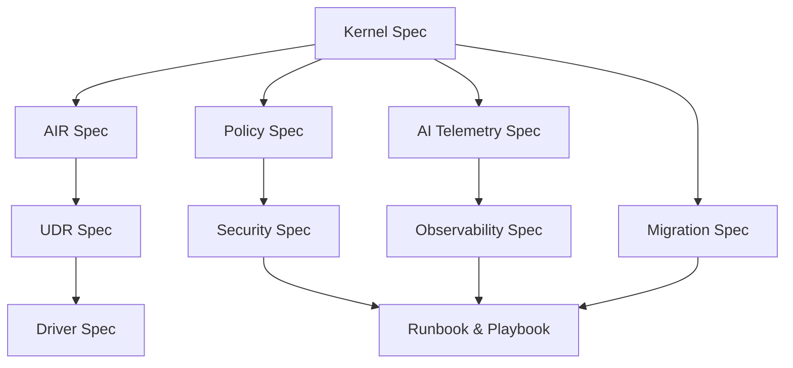

> **Purpose** — This manifest provides a canonical index of all documentation assets in the **NuBlox SQLx OS v4.0** release suite.  
> It defines ownership, purpose, and storage path for each document and serves as a structured entrypoint for developers, architects, compliance officers, and operators.

---

# 🧩 Table of Contents

| # | Document | Category | Purpose | Path |
|:--|:--|:--|:--|:--|
| 1 | **SQLx-Kernel-Spec-v4.0.md** | Architecture | Defines the Kernel — core modules, schedulers, API surfaces, and state machines. | `docs/specs/kernel/SQLx-Kernel-Spec-v4.0.md` |
| 2 | **SQLx-AIR-Spec-v4.0.md** | Architecture | Describes the Abstract Intermediate Representation grammar, node model, and normalization logic. | `docs/specs/air/SQLx-AIR-Spec-v4.0.md` |
| 3 | **SQLx-UDR-Spec-v4.0.md** | Architecture | Defines the Universal Dialect Runtime — cross-dialect translation and bidirectional compilation. | `docs/specs/udr/SQLx-UDR-Spec-v4.0.md` |
| 4 | **SQLx-Driver-WireProtocol-Spec-v4.0.md** | Engineering | Specifies the native driver layer (MySQL + PostgreSQL) — wire packets, handshake, and AI-assisted adaptation. | `docs/specs/drivers/SQLx-Driver-WireProtocol-Spec-v4.0.md` |
| 5 | **SQLx-AI-Telemetry-Schema-v4.0.md** | Observability | Defines the AI Telemetry Schema (ATS): metrics, traces, learning artifacts, and privacy controls. | `docs/specs/telemetry/SQLx-AI-Telemetry-Schema-v4.0.md` |
| 6 | **SQLx-Policy-Graph-and-RBAC-v4.0.md** | Governance | Details the Policy Graph (π) and RBAC Matrix: access control, obligations, compliance packs. | `docs/specs/policy/SQLx-Policy-Graph-and-RBAC-v4.0.md` |
| 7 | **SQLx-Observability-and-SLOs-v4.0.md** | Observability | Defines metrics, SLIs/SLOs, alert rules, and dashboards for Kernel, Driver, UDR, Policy, and AI. | `docs/specs/observability/SQLx-Observability-and-SLOs-v4.0.md` |
| 8 | **SQLx-Migration-and-DDL-Strategy-v4.0.md** | Engineering | Describes online-safe schema migration framework — micro-migrations, rollback, audit, and safety gates. | `docs/specs/migration/SQLx-Migration-and-DDL-Strategy-v4.0.md` |
| 9 | **SQLx-Security-Whitepaper-and-ThreatModel-v4.0.md** | Security | Comprehensive threat model, STRIDE analysis, cryptography, IAM, SDL, and AI governance. | `docs/security/SQLx-Security-Whitepaper-and-ThreatModel-v4.0.md` |
| 10 | **SQLx-Runbook-and-IncidentPlaybook-v4.0.md** | Operations | Defines incident detection, classification, and remediation workflows with CLI automation. | `docs/ops/runbooks/SQLx-Runbook-and-IncidentPlaybook-v4.0.md` |

---

# 🔐 Governance & Compliance Mapping

| Framework | Relevant Docs | Coverage |
|:--|:--|:--|
| **GDPR** | Policy, Security, Migration | Residency, masking, DPO obligations |
| **ISO 27001** | Security, Observability | Logging, risk management |
| **SOC 2 Type II** | Kernel, Policy, Runbook | Availability, confidentiality |
| **HIPAA** | Security, Policy | PHI masking, audit |
| **PCI DSS** | Security | PAN encryption, key management |
| **NIST 800-53** | Security, Policy, Migration | AC, AU, SC, SI controls |

---

# ⚙️ Integration Map (Mermaid)



---

# 🧠 Future Document Additions (v4.1+)

| Planned | Description |
|:--|:--|
| **SQLx-ControlPlane-Spec-v4.1.md** | Defines workspace orchestration, multi-tenant lifecycle, and provisioning APIs. |
| **SQLx-Cache-and-Policy-Learning-v4.1.md** | Documents self-learning cache and predictive policy engine. |
| **SQLx-GTM-and-Licensing-v4.1.md** | Outlines market model, workspace licensing, and compliance tiers. |
| **SQLx-Studio-UX-Spec-v4.1.md** | Defines UI/UX for Studio, AI co-pilot integration, and visual telemetry. |

---

# 🧾 Ownership & Maintenance

- **Author & Maintainer:** Stephen Spittal (NuBlox Founder)  
- **Documentation Lead:** NuBlox Core Engineering  
- **Last Reviewed:** 2025-10-16  
- **Next Review:** 2026-01-01  

All specs follow:
- [x] Version tagging `vMAJOR.MINOR`  
- [x] Semantic document versioning  
- [x] SHA256 checksum in CI build  
- [x] Open governance model — public RFCs in `/docs/rfcs/`

---

# ✅ Version & Build Traceability

Each document is registered in the CI/CD documentation manifest:

```yaml
docs:
  build_version: "4.0.0"
  release_channel: "alpha"
  generated_at: "2025-10-16T18:12:00Z"
  build_sha: "sqlx-docs-v4.0-ab12cdef"
```

---

# 🧭 Repository Navigation

```bash
cd docs/specs/kernel
code SQLx-Kernel-Spec-v4.0.md

cd docs/specs/telemetry
code SQLx-AI-Telemetry-Schema-v4.0.md

cd docs/security
code SQLx-Security-Whitepaper-and-ThreatModel-v4.0.md
```

---

# 🏁 Closing Note

> **SQLx OS v4.0** establishes a complete, composable documentation suite spanning architecture, AI, compliance, and operations — forming the foundation of a truly self-governing database operating system.

---
