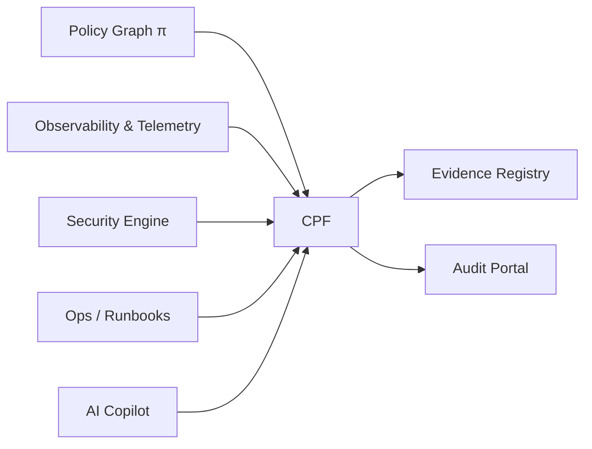
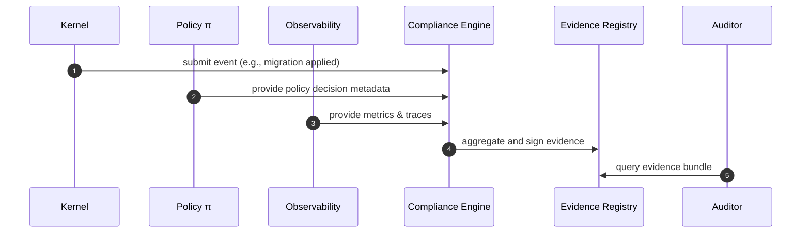

# SQLx Compliance Policy Framework v4.0  
*Unified Governance, Risk, and Compliance (GRC) Architecture for SQLx OS*  
**Version:** 4.0 **Status:** Stable **Owner:** NuBlox Labs — Security & Compliance Engineering  

---

## Executive Summary  
SQLx OS integrates compliance as a **first-class runtime system**, not an afterthought.  
This framework defines how SQLx ensures end-to-end **data protection**, **auditing**, and **regulatory conformance** across all operational domains—security, observability, policy, migration, and AI.  

The Compliance Policy Framework (CPF) establishes mappings to global regulations (GDPR, HIPAA, SOC 2, SOX, PCI-DSS) and defines evidence capture pipelines so every control is both **verifiable** and **machine-auditable**.

---

## 1  Objectives  

| Goal | Description |
|:--|:--|
| **Unified GRC Plane** | Centralized compliance logic for Kernel, Studio, and Copilot. |
| **Continuous Evidence** | Automatic capture of control evidence through telemetry. |
| **Policy Integration** | Alignment with π (Policy Graph) and security events. |
| **Tenant-Aware Isolation** | Controls applied per workspace and residency zone. |
| **Audit-Ready Artifacts** | Deterministic reports and signed evidence bundles. |

---

## 2  Architecture Overview  



**Components**

| Component | Role |
|:--|:--|
| **Compliance Engine (CE)** | Core evaluator enforcing control sets and policies. |
| **Evidence Registry (ER)** | Immutable store of structured compliance records. |
| **Control Library (CL)** | Versioned catalogue of mapped frameworks (GDPR, SOC2, HIPAA…). |
| **Audit Portal (AP)** | Interface for auditors to query evidence and attestations. |

---

## 3  Regulatory Mapping  

| Framework | Primary Controls Implemented | Artifacts Produced |
|:--|:--|:--|
| **GDPR** | Data residency, right-to-erasure, consent tracking | Data retention configs, deletion logs |
| **HIPAA** | PHI access logging, encryption at rest & transit | `sqlx_audit_phi` table, key rotation logs |
| **SOC 2 Type II** | Security, availability, processing integrity | SLO compliance metrics, policy approvals |
| **SOX** | Change management, audit evidence, segregation of duties | Migration ledger, RBAC audit trails |
| **PCI-DSS** | Access control, encryption, vulnerability management | Encrypted key stores, vulnerability reports |

Each mapping links to a canonical control ID (e.g., `GDPR-A5`, `SOC2-CC1.2`) in the Control Library.

---

## 4  Control Library Schema  

```json
{
  "control_id": "GDPR-A5",
  "title": "Data minimization and purpose limitation",
  "category": "Data Protection",
  "requires": ["masking", "retention_policy"],
  "verification": "auto",
  "mapped_components": ["policy", "kernel", "ai"],
  "evidence": ["telemetry.trace", "policy.decision"],
  "status": "implemented"
}
```

Controls are expressed as JSON documents under  
`/docs/compliance/controls/{framework}/{control_id}.json`.

---

## 5  Evidence Capture  

### 5.1  Evidence Types  

| Type | Source | Retention | Example |
|:--|:--|:--|:--|
| **Telemetry Evidence** | ATS / Observability | 400 days | SLO compliance metrics |
| **Audit Logs** | Policy / Kernel | 7 years | DDL + DCL signed events |
| **Configuration Snapshots** | Kernel / Ops | 1 year | Pool, policy, and migration configs |
| **Attestation Reports** | Human / AI verified | 7 years | SOC 2 audit exports |
| **Anomaly Evidence** | Copilot feedback | 1 year | Policy drift detection |

All evidence items carry a cryptographic signature and immutable hash chain.

---

## 6  Compliance Engine Workflow  



**Evaluation Logic**
1. Receive event and classify by framework.
2. Match to applicable controls.
3. Verify control implementation status.
4. Generate signed evidence record.
5. Update compliance dashboard and telemetry.

---

## 7  Evidence Registry Schema  

```sql
CREATE TABLE sqlx_evidence_registry (
  id CHAR(64) PRIMARY KEY,
  tenant VARCHAR(64),
  control_id VARCHAR(32),
  event_type VARCHAR(64),
  artifact_uri TEXT,
  hash CHAR(64),
  signature CHAR(64),
  created_at TIMESTAMP,
  verified BOOLEAN
);
```

All records are append-only. Signatures use Ed25519 and are periodically anchored to a blockchain or timestamp authority (TSA).

---

## 8  Policy & AI Integration  

* **Policy Graph π** supplies decision context (who, what, where, why).  
* **Copilot AI** evaluates anomaly frequency to predict control drift.  
* **Feedback Loop:**  
  - Policy → Compliance → AI → Policy (continuous improvement).  
* AI flags repeated violations and can auto-recommend policy updates.  

**Reward Signal**
```
reward = +1 × (verified_evidence / total_expected) − 5 × (violations)
```

---

## 9  Audit Portal  

* Web-based interface served from `/audit`.  
* Query by control ID, timeframe, or tenant.  
* Export PDF/CSV bundles for auditors.  
* Role-restricted (`role:auditor`).  
* Optional external verification API for regulators.  

**Example Query**
```sql
SELECT * FROM sqlx_evidence_registry 
WHERE control_id='SOC2-CC1.2' AND tenant='acme';
```

---

## 10  Compliance Telemetry  

| Metric | Description | Unit | Target |
|:--|:--|:--|:--|
| `sqlx_compliance_controls_total` | Number of implemented controls | count | ≥ 95 % |
| `sqlx_compliance_violations_total` | Violations detected per week | count | ≤ 1 |
| `sqlx_evidence_latency_ms` | Evidence signing delay | ms | < 200 |
| `sqlx_audit_queries_total` | Portal access volume | count | n/a |

---

## 11  Security & Privacy Considerations  

* **PII Redaction:** control metadata contains tags only, not data.  
* **Encryption:** evidence stored with AES-256-GCM.  
* **Access Control:** scoped roles — `auditor`, `compliance.officer`, `system`.  
* **Tamper Detection:** ledger verified nightly; mismatches trigger incident.  
* **AI Ethics:** Copilot decisions on compliance changes require human review.  

---

## 12  Configuration Example  

```yaml
compliance:
  frameworks: ["GDPR", "SOC2", "HIPAA"]
  evidenceStore: /var/sqlx/compliance/evidence.db
  auditPortal:
    enabled: true
    retention: 7y
  aiIntegration: true
  privacy:
    redactPII: true
    encryptEvidence: true
```

---

## 13  Performance & Availability Targets  

| SLI | Target | Notes |
|:--|:--|:--|
| Evidence write latency | < 250 ms | per event |
| Portal uptime | ≥ 99.9 % | monthly |
| Verification success rate | ≥ 99.99 % | signature validation |
| Control mapping coverage | ≥ 95 % | frameworks in scope |

---

## 14  Open Questions (RFCs)  

1. Should SQLx adopt **OpenGRC Schema** as export format?  
2. How to federate compliance data across multi-tenant clusters securely?  
3. Should AI Copilot recommend new controls dynamically (auto-GRC evolution)?  
4. Can blockchain anchoring become mandatory for evidence proofs?  
5. Should Compliance Portal expose a **GraphQL API** for auditors?  

---

## 15  Related Documents  

* `docs/specs/policy/SQLx-Policy-Graph-and-RBAC-v4.0.md`  
* `docs/specs/kernel/SQLx-Kernel-Spec-v4.0.md`  
* `docs/specs/telemetry/SQLx-AI-Telemetry-Schema-v4.1.md`  
* `docs/security/SQLx-Security-Whitepaper-and-ThreatModel-v4.0.md`  
* `docs/specs/observability/SQLx-Observability-and-SLOs-v4.0.md`  

---

**Author:** NuBlox Compliance & Security Engineering **Reviewed:** October 2025  
**License:** NuBlox SQLx OS — Autonomous Database Framework
