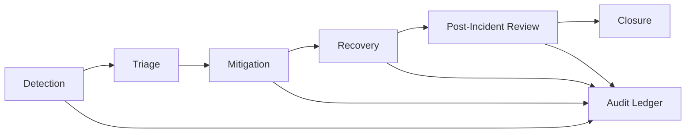

> **Purpose** — Provide standardized operational playbooks for incident detection, classification, mitigation, and recovery across the SQLx OS ecosystem.  
> Covers the Kernel, Driver, UDR, Policy, AI Fabric, and Control Plane subsystems.

---

# 1. Objectives

- Ensure **rapid, consistent, and auditable** response to operational issues.  
- Define **severity levels**, **ownership**, and **response timelines (SLO-based)**.  
- Provide **automated playbooks** (CLI + API invocations).  
- Establish a **post-incident review** and **continuous improvement** cycle.

---

# 2. Severity Classification

| Sev | Definition | Impact | Target Response | Target Resolution |
|:--:|:--|:--|:--|:--|
| **P1** | Platform-wide outage / data loss risk | Critical | 5 min | 1 hr |
| **P2** | Major subsystem degraded (Kernel/Driver/Policy) | High | 15 min | 4 hr |
| **P3** | Partial degradation / slow path | Medium | 30 min | 8 hr |
| **P4** | Minor bug / cosmetic issue | Low | 24 hr | Planned fix |
| **P5** | Advisory / improvement request | None | Triage weekly | As scheduled |

---

# 3. Detection Channels

| Source | Description |
|:--|:--|
| **ATS Alerts** | Metric-based triggers from AI Telemetry Schema |
| **OTel Alerts** | Prometheus/Loki alert rules |
| **Anomaly Detection (AI Fabric)** | Pattern-based detection on telemetry |
| **SOC/SIEM Feeds** | Security event triggers |
| **Manual Reports** | User or developer escalation via Studio or CLI |

---

# 4. Incident Lifecycle



---

# 5. Triage Protocol

1. **Identify subsystem:** Kernel, Driver, UDR, Policy, AI, or Infra.  
2. **Verify severity:** based on impact and scope.  
3. **Assign on-call:** Owner from `OWNERS.md`.  
4. **Acknowledge in chat (Slack/PagerDuty)** within SLA.  
5. **Run diagnostic command:**

```bash
sqlx diag run --scope kernel --since 15m
```

6. Review ATS traces and error rates:
```bash
sqlx diag analyze --metric sqlx_driver_errors_total
```

---

# 6. Automated Playbooks (CLI)

| Scenario | Command | Description |
|:--|:--|:--|
| **Driver connection storm** | `sqlx ops throttle --driver mysql --limit 200rps` | Rate-limit new connections |
| **Kernel deadlock** | `sqlx kernel reset --force` | Restart core worker safely |
| **UDR translation errors** | `sqlx udr flush-cache --scope dialect:postgres` | Reset compiler cache |
| **Policy deny storm** | `sqlx policy rollback --to version:prev` | Revert to previous policy pack |
| **AI Fabric loop anomaly** | `sqlx ai disable --agent optimizer-v2` | Disable problematic agent |
| **Migration stuck** | `sqlx migrate rollback --id MIG20251016-09` | Rollback in progress |
| **Telemetry outage** | `sqlx observability restart --collector` | Restart telemetry stack |

All automated commands emit ATS `ops.*` events with `trace_id` linkage.

---

# 7. Example: Driver Timeout Spike (P2)

**Detection:**  
Prometheus alert:
```
sqlx_driver_errors_total{class="timeout"} > 0.5/s for 5m
```

**Diagnostics:**
```bash
sqlx diag run --scope driver --dialect mysql
sqlx diag trace --error timeout
```

**Actions:**
1. Verify DB health and latency.  
2. Reduce concurrency:
```bash
sqlx ops throttle --driver mysql --limit 100rps
```
3. Enable retry strategy:
```bash
sqlx driver set --param retry=true
```
4. Monitor recovery metrics:
```bash
sqlx diag watch sqlx_driver_latency_ms
```

**Resolution target:** within 1 hr.

---

# 8. Example: Policy Deny Spike (P3)

**Detection:**  
ATS: `policy.denies_total` increased 10× baseline.

**Diagnostics:**
```bash
sqlx policy diff --from version:20251014 --to version:20251016
```

**Actions:**
1. Identify new deny rules.  
2. Run dry-run simulation:
```bash
sqlx policy simulate --pack current
```
3. Rollback if misconfigured:
```bash
sqlx policy rollback --to version:prev
```

**Resolution target:** within 2 hr.

---

# 9. Example: AI Fabric Drift (P3)

**Detection:**  
AI optimizer suggestions cause regressions.

**Diagnostics:**
```bash
sqlx ai compare --model optimizer-v1 optimizer-v2
sqlx ai diff --metric plan_latency
```

**Actions:**
1. Disable agent:
```bash
sqlx ai disable --agent optimizer-v2
```
2. Revert to stable:
```bash
sqlx ai enable --agent optimizer-v1
```
3. File model incident in Studio under `AI-FABRIC-INCIDENTS`.

**Resolution:** within 4 hr.

---

# 10. Post-Incident Review (PIR)

| Field | Description |
|:--|:--|
| **Incident ID** | Unique traceable ID |
| **Summary** | High-level overview |
| **Impact** | Affected tenants/workspaces |
| **Timeline** | Detection → Resolution |
| **Root Cause** | Systemic issue |
| **Mitigation** | Fix implemented |
| **Follow-ups** | Actions assigned |
| **Lessons Learned** | Improvements logged |

Stored as Markdown in `/docs/ops/reports/YYYY/MM/INCIDENT-<id>.md`.

---

# 11. Communication & Escalation

| Stage | Channel | Example |
|:--|:--|:--|
| Detection | PagerDuty / Slack `#sqlx-ops` | Automated |
| Mitigation | `#sqlx-incident` thread | Command handoffs |
| Recovery | Jira issue link | Tracking |
| PIR | Internal wiki + Git commit | Archival |

---

# 12. Integration with Observability

- Every incident event is **ATS-linked** (`trace_id`, `incident_id`).  
- Traces and metrics are frozen in a “snapshot” dataset.  
- Logs replayable for forensics (Loki/OpenSearch).  
- Cross-reference with SLO burn-down reports.

---

# 13. Automation & AI Assist

- AI Fabric agents analyze telemetry patterns to predict incidents.  
- LLM-based summarizer produces initial PIR draft.  
- Auto-classifier labels incidents (kernel/driver/policy).  
- Future: closed-loop remediation for repeatable low-risk events.

---

# 14. Security & Compliance Tie-in

- All `sec.*` and `ops.*` events appended to Audit Ledger.  
- Policy packs require **dual approval** for rollback post-incident.  
- Sensitive incidents (data exposure, auth failure) auto-notify DPO.  
- PIRs linked to compliance evidence.

---

# 15. Open Questions

1. Automate PIR drafting directly into Git commits via `sqlx ops review`?  
2. Support “chaos rehearsal” incidents for resilience scoring?  
3. Integrate Studio live view for ongoing incident visualization?  
4. AI Fabric auto-repair pipelines — safe default or opt-in only?  

---
