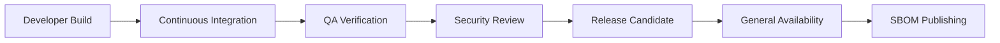

# SQLx Release Process and SBOM Guide v4.0  
*Secure Build, Verification, and Provenance Pipeline for NuBlox SQLx OS*  
**Version:** 4.0 **Status:** Stable **Owner:** NuBlox Labs — Release & Security Engineering  

---

## Executive Summary  
This document defines the **release engineering lifecycle** and **Software Bill of Materials (SBOM)** process for NuBlox SQLx OS.  
It ensures every build—from developer preview to enterprise release—is **reproducible**, **verifiable**, and **secure by design**.  
Releases are treated as **signed supply-chain artifacts** governed by policy, telemetry, and compliance integration.

---

## 1  Objectives  

| Goal | Description |
|:--|:--|
| **Reproducible Builds** | Guarantee byte-for-byte deterministic output. |
| **Cryptographic Integrity** | Sign all build artifacts using Ed25519 or SHA3-512. |
| **Provenance Tracking** | Embed build metadata, commit hash, and source tree manifest. |
| **SBOM Compliance** | Generate SPDX-compatible BOMs for all components. |
| **Zero-Trust Supply Chain** | Verify dependencies, contributors, and runtime environments. |

---

## 2  Release Lifecycle  



**Release Phases**

| Phase | Output | Validation |
|:--|:--|:--|
| **Developer Build** | Nightly artifacts | Lint, test, typecheck |
| **CI Build** | Signed container images | Automated test suite |
| **QA Verification** | QA bundle | Integration + regression tests |
| **Security Review** | SBOM + audit report | Dependency and CVE scan |
| **Release Candidate** | Candidate tag | Manual review |
| **GA Release** | Public tag + binaries | Signed and published |
| **LTS Release** | Long-term supported tag | Annual certification |

---

## 3  Build Metadata  

Every release embeds metadata under `/meta/release.json`:

```json
{
  "version": "6.0.0",
  "commit": "d3b4f2e",
  "build_date": "2025-10-17T09:00:00Z",
  "builder": "github.com/8140spitt/NuBlox-SQLx-OS/actions",
  "compiler": "tsc 5.9.1",
  "hash": "sha3-512:ab34ef...",
  "signature": "ed25519:9f3a...",
  "sbom_ref": "spdx://sqlx-os-6.0.0.spdx.json"
}
```

---

## 4  Versioning Strategy  

* Follows **Semantic Versioning (SemVer 2.0)**:
  - **MAJOR** → incompatible API or schema change  
  - **MINOR** → new functionality backward-compatible  
  - **PATCH** → bug/security fix only  

* Channels: `alpha`, `beta`, `rc`, `stable`, `lts`

Example:  
```
v6.0.0-beta.2
v6.0.0
v6.1.0
v7.0.0-lts
```

* Tags generated automatically in CI via `release.yml`.

---

## 5  Software Bill of Materials (SBOM)

### 5.1  SBOM Format  
* Standard: **SPDX 2.3**  
* Output: `sqlx-os-<version>.spdx.json`  
* Location: `/release/sbom/`  

**Example Entry**
```json
{
  "SPDXID": "SPDXRef-Package-@nublox/sqlx-core",
  "name": "@nublox/sqlx-core",
  "versionInfo": "6.0.0",
  "supplier": "NuBlox Labs",
  "originator": "Stephen Spittal",
  "checksums": [
    {"algorithm": "SHA3-512", "checksumValue": "b7d9..."}
  ],
  "licenseConcluded": "MIT",
  "externalRefs": [
    {"referenceType": "purl", "referenceLocator": "pkg:npm/%40nublox/sqlx-core@6.0.0"}
  ]
}
```

### 5.2  Generation Workflow  
```bash
pnpm run build
pnpm run sbom:generate
pnpm run sign --key ed25519.pem
pnpm run verify
```

### 5.3  SBOM Validation  

| Check | Description | Tool |
|:--|:--|:--|
| Schema | Validate SPDX JSON structure | `spdx-tools` |
| Integrity | Verify checksum matches source | built-in verifier |
| Dependency | Ensure no GPL/unknown license | `license-checker` |
| Vulnerability | Check CVEs | `osv-scanner` |

---

## 6  Signing and Verification  

### 6.1  Signature Chain  

| Artifact | Signature Type | Verifier |
|:--|:--|:--|
| Source Tarball | SHA3-512 | Kernel verifier |
| Container Image | Cosign (Sigstore) | OIDC identity |
| SBOM | Ed25519 | Compliance Engine |
| Binary/CLI | Detached `.sig` | CLI verifier |
| Documentation | SHA256 | Release script |

**Signing Flow**
1. Compute digest for each artifact.  
2. Sign digest using `release.key`.  
3. Store public key in `/release/keys/pub.pem`.  
4. Verify during deployment and audit.

---

## 7  Provenance Metadata  

All releases include a **provenance manifest**:

```json
{
  "builder": "GitHub Actions",
  "repo": "NuBlox-SQLx-OS",
  "workflow": "release.yml",
  "trigger": "tag:v6.0.0",
  "environment": "node@24.x, pnpm@10.x, tsup@8.5",
  "verified": true
}
```

Linked in SBOM via `externalRefs.provenance`.

---

## 8  Deployment Verification  

* Kernel verifies all package signatures before startup.  
* Policy Graph records proof of authenticity in audit logs.  
* Observability layer tracks deployment version and drift.  
* AI Copilot monitors anomaly rate post-release.  

**Metric:**  
`sqlx_release_deploy_drift{tenant}` → difference between declared and running versions.  

---

## 9  Secure CI/CD Pipeline  

| Stage | Tool | Security Controls |
|:--|:--|:--|
| Build | `pnpm + tsup` | locked dependencies, checksum validation |
| Test | `jest + vitest` | sandboxed runners |
| SBOM | `spdx-sbom-generator` | reproducibility |
| Sign | `cosign` | OIDC identity verification |
| Scan | `osv-scanner` | vulnerability assessment |
| Publish | `gh release create` | signed tag only |
| Verify | `sqlx verify release` | Kernel-integrated |

**CI Policy**:  
Only signed commits from verified maintainers can trigger GA build.

---

## 10  Rollback & Patch Workflow  

1. **Detect regression** via telemetry (`sqlx_release_errors_total`).  
2. **Freeze deployment** → disable auto-updates.  
3. **Generate patch branch** → `release/v6.0.1`.  
4. **Run regression test suite**.  
5. **Publish signed hotfix release**.  

All patches recorded in `release/history.yaml`.

---

## 11  Compliance Integration  

* SBOM and provenance uploaded to the **Evidence Registry**.  
* Compliance Engine validates control `SOX-ITGC-ChangeControl`.  
* Telemetry links every deployment event to compliance artifacts.  

**Evidence Example**
```json
{
  "event": "release.publish",
  "version": "6.0.0",
  "hash": "sha3-512:ab34ef...",
  "signature": "ed25519:9f3a...",
  "control_id": "SOX-ITGC-ChangeControl",
  "verified": true
}
```

---

## 12  Performance Targets  

| Metric | Target | Notes |
|:--|:--|:--|
| Build reproducibility | 100 % | deterministic |
| SBOM generation time | < 15 s | per package |
| Verification latency | < 500 ms | CLI check |
| Deployment drift detection | < 5 min | via telemetry |
| Signature verification accuracy | 100 % | deterministic |

---

## 13  Configuration Example  

```yaml
release:
  sign:
    key: /etc/sqlx/release.key
    algorithm: ed25519
  sbom:
    format: spdx
    validate: true
  provenance:
    includeEnv: true
  ci:
    enforceSignedCommits: true
    allowUnverifiedTags: false
  retention:
    artifacts: 2y
```

---

## 14  Open Questions (RFCs)  

1. Should SBOM move to **CycloneDX 1.6** for multi-language dependency tracking?  
2. Can AI Copilot predict release risk based on telemetry and issue history?  
3. Should signature chain use **hardware-backed keys (YubiHSM)** for LTS builds?  
4. How to support **air-gapped enterprise verification** of SBOMs?  
5. Should the release process export **SLSA provenance levels** (Level 3+)?  

---

## 15  Related Documents  

* `docs/compliance/SQLx-Compliance-Policy-Framework-v4.0.md`  
* `docs/specs/kernel/SQLx-Kernel-Spec-v4.0.md`  
* `docs/specs/telemetry/SQLx-AI-Telemetry-Schema-v4.1.md`  
* `docs/security/SQLx-Security-Whitepaper-and-ThreatModel-v4.0.md`  
* `docs/ops/runbooks/SQLx-Runbook-and-IncidentPlaybook-v4.0.md`

---

**Author:** NuBlox Engineering **Reviewed:** October 2025  
**License:** NuBlox SQLx OS — Autonomous Database Framework
