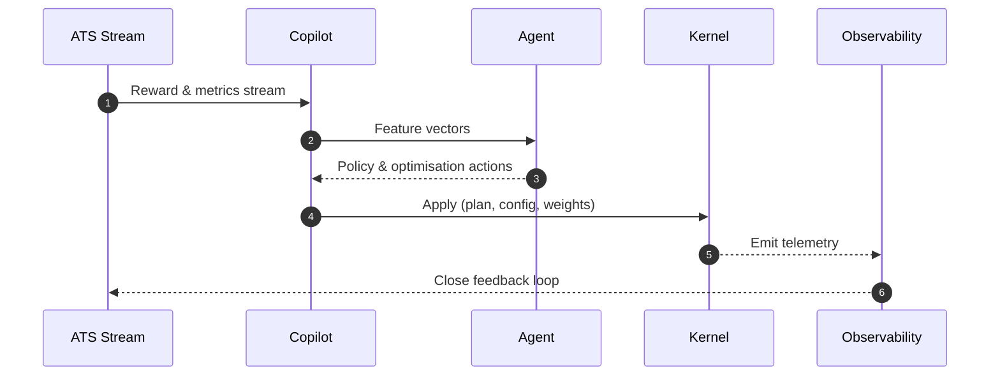

Excellent — here’s the **full, single-canvas, publication-grade** document for your AI layer, unifying everything from Telemetry and Kernel to Policy and Copilot orchestration.

Save as:
`docs/specs/ai/SQLx-Copilot-Architecture-v1.0.md`

---

````markdown
# SQLx Copilot Architecture v1.0  
*Autonomous AI Fabric for Self-Optimising, Policy-Aware, and Explainable Database Operations*  
**Version:** 1.0 **Status:** Stable **Owner:** NuBlox Labs — AI Fabric Team  

---

## Executive Summary  
The **SQLx Copilot** is the cognitive control plane of SQLx OS — a distributed AI system that observes every trace, policy decision, and schema evolution to continuously optimise the database ecosystem.  
Copilot turns raw telemetry into structured reasoning, learning from reward signals and reinforcement feedback to adjust plans, caches, migrations, and compliance heuristics automatically.  
This document specifies the architecture, agent model, reinforcement framework, and integration with Kernel, Policy Graph, Observability, and UDR.

---

## 1  Purpose  
- Transform SQLx OS into a **self-tuning, self-healing, and policy-compliant** database runtime.  
- Learn and optimise across **performance**, **security**, **cost**, and **governance** objectives.  
- Provide an **explainable AI layer** with deterministic outputs for auditable reasoning.  
- Integrate seamlessly with the **Telemetry Kernel Bus (TKB)** and **ATS** schema.

---

## 2  System Overview  

```mermaid
flowchart LR
    OBS[Telemetry Kernel Bus] --> COP[SQLx Copilot]
    COP --> OPT[Optimisation Actions]
    COP --> EXP[Explanations & Insights]
    OPT --> KRN[Kernel Scheduler]
    OPT --> PPC[Predictive Plan Cache]
    OPT --> MIG[Migration Engine]
    OPT --> POL[Policy Engine]
    OPT --> UDR[UDR Bridge]
````

**Copilot Functions**

1. **Observe** — Ingest traces, metrics, logs, and learning artifacts via ATS.
2. **Reason** — Evaluate patterns using embedded ML models and heuristics.
3. **Decide** — Generate configuration deltas, policy recommendations, or re-training triggers.
4. **Act** — Apply safe adjustments through Kernel APIs under policy supervision.
5. **Explain** — Produce structured reasoning narratives for transparency.

---

## 3  Agent Model

Copilot is composed of modular agents, each specialising in a system domain.

| Agent              | Scope                      | Description                                                  |
| :----------------- | :------------------------- | :----------------------------------------------------------- |
| **OptimizerAgent** | Performance                | Learns latency patterns, recommends plan changes.            |
| **SchemaAgent**    | Schema & Migration         | Observes DDL diffs, predicts risk, generates rollback plans. |
| **PolicyAgent**    | Compliance                 | Tunes RBAC/ABAC rules based on observed denials and audits.  |
| **SecurityAgent**  | Threat & anomaly detection | Learns TLS/auth anomalies, detects misconfigurations.        |
| **TopologyAgent**  | Connection routing         | Adapts pool weights and replica distribution.                |
| **LanguageAgent**  | NL/Code interface          | Parses developer intent for plan synthesis or documentation. |

Agents communicate through the **AIF Bus**, a lightweight pub/sub layer over the TKB.

---

## 4  Reinforcement Framework

### 4.1  Reward Function

Reward is derived from ATS events and normalised across tenants.

```txt
R = α₁*(−latency_ms) + α₂*(−error_rate) + α₃*(policy_compliance)
    + α₄*(cache_hit_ratio) + α₅*(availability)
```

Weights (α₁..α₅) are dynamically tuned via policy and business priorities.

### 4.2  Learning Cycle



### 4.3  Learning Modes

| Mode                       | Description                                    |
| :------------------------- | :--------------------------------------------- |
| **Online RL**              | Real-time feedback from telemetry streams.     |
| **Batch RL**               | Offline training on Parquet archives.          |
| **Supervised Fine-Tuning** | Periodic updates using labelled outcomes.      |
| **Simulated Environments** | Sandbox replay for non-destructive evaluation. |

---

## 5  Data Pipeline

**Sources:**

* ATS Telemetry Streams (`sqlx.learn.reward`, `sqlx.learn.embed`)
* Traces/Metrics/Logs (OTLP)
* Migration and Policy Events

**Sinks:**

* Copilot Registry (models, parameters)
* AI Artifact Store (embeddings, checkpoints)
* Kernel Configuration Bus

**Storage Format:** Parquet (batch) + Kafka (stream); metadata signed and versioned.

---

## 6  Model Architecture

### 6.1  Core Models

| Model                      | Purpose                               | Type                |
| :------------------------- | :------------------------------------ | :------------------ |
| `sqlx-emb-encoder-v1`      | Encode AIR graphs into embeddings     | Transformer Encoder |
| `sqlx-reward-regressor-v1` | Predict plan reward                   | Feed-forward NN     |
| `sqlx-policy-suggester-v1` | Generate new policy constraints       | Seq2Seq             |
| `sqlx-anomaly-detector-v1` | Detect performance/security anomalies | Autoencoder         |
| `sqlx-router-tuner-v1`     | Optimise connection routing weights   | RL Agent            |

### 6.2  Model Registry Schema

```json
{
  "model_id": "sqlx-emb-encoder-v1",
  "version": "1.0.12",
  "sha256": "f3a9...",
  "created": "2025-10-17T09:00:00Z",
  "metrics": {"loss":0.012,"reward":0.93},
  "approved": true,
  "stage": "prod"
}
```

---

## 7  Copilot APIs

### 7.1  Control API

```ts
export interface CopilotAPI {
  suggestPlan(air: AIRNode): Promise<PlanSuggestion>;
  optimizePolicy(policyPack: string): Promise<PolicyDiff>;
  adjustScheduler(weights: Record<string, number>): Promise<void>;
  explain(traceId: string): Promise<Explanation>;
}
```

### 7.2  Example: Plan Suggestion

```json
{
  "input": "SELECT name FROM users WHERE age > 30",
  "suggestion": {
    "plan_hash": "ph:ab12",
    "expected_reward": +1.3,
    "rationale": "predicate pushdown + index idx_age",
    "confidence": 0.96
  }
}
```

---

## 8  Explainability and Transparency

Each Copilot action must generate a **verifiable explanation**:

| Dimension         | Example                                                   |
| :---------------- | :-------------------------------------------------------- |
| **Decision**      | “Increased scheduler weight for class L from 0.45 → 0.55” |
| **Reason**        | “p95 latency breached SLO under current weights”          |
| **Evidence**      | “sqlx_exec_latency_ms histogram”                          |
| **Confidence**    | `0.91`                                                    |
| **Policy Impact** | “No residency violation detected”                         |

Explanations are stored in `aif_explanations` collection for audit.

---

## 9  Integration Points

| Layer                 | Integration                                      | Purpose                  |
| :-------------------- | :----------------------------------------------- | :----------------------- |
| **Kernel**            | Adjust scheduler weights, cache TTL, retry logic | Real-time tuning         |
| **UDR**               | Optimise routing targets, parameter binding      | Plan-level optimisation  |
| **Policy Engine (π)** | Suggest rules, learn denial patterns             | Compliance reinforcement |
| **Migration Engine**  | Risk evaluation, rollback prediction             | Safe schema evolution    |
| **Observability**     | Reward ingestion, anomaly detection              | Continuous feedback      |

All integrations mediated via signed Kernel API calls with least privilege.

---

## 10  Telemetry Alignment

Copilot both **consumes** and **produces** ATS events.

**Outbound Events**

* `ai.reward.emit`
* `ai.model.update`
* `ai.plan.suggest`
* `ai.policy.diff`
* `ai.explain.log`

**Inbound Streams**

* All `sqlx_*` metrics and logs
* `policy.*`, `driver.*`, `kernel.*`, `udr.*` spans

---

## 11  Security & Governance

* **Model Signing**: SHA-256 checksum, SBOM, and signature verification.
* **Access Control**: Copilot actions restricted to scoped tokens (`aif.manage`, `aif.read`).
* **Privacy**: Learning data stripped of literals and PII before ingestion.
* **Approval Workflow**: human sign-off required for model promotion to `prod`.
* **Explainability**: all automated changes have trace-linked audit entries.

---

## 12  Deployment Topology

| Mode            | Description                                                      |
| :-------------- | :--------------------------------------------------------------- |
| **Embedded**    | Single-node, lightweight, co-process mode with Kernel (default). |
| **Distributed** | Multi-tenant AIF service with Kafka + object storage.            |
| **Federated**   | Privacy-preserving model aggregation across tenants (DP-SGD).    |

**Scaling:** horizontally via partitioned ATS topics and stateless worker pods.

---

## 13  Configuration Example

```yaml
aif:
  models:
    embEncoder: sqlx-emb-encoder-v1
    rewardRegressor: sqlx-reward-regressor-v1
  streams:
    reward: sqlx.learn.reward
    embed: sqlx.learn.embed
  actions:
    autoTuneScheduler: true
    suggestPolicies: true
    enableSelfHealing: true
  explain:
    store: /var/sqlx/aif/explanations
    retention: 90d
```

---

## 14  Performance Targets

| Metric                       | Target   | Notes                 |
| :--------------------------- | :------- | :-------------------- |
| Reward ingestion latency     | < 200 ms | ATS stream round-trip |
| Suggestion generation        | < 1 s    | AIR graph ≤ 500 nodes |
| Model update cycle           | ≤ 24 h   | full retraining       |
| Explanation generation       | < 500 ms | post-action           |
| Accuracy delta (epoch→epoch) | ≥ +0.5 % | reward improvement    |

---

## 15  Open Questions (RFCs)

1. Should Copilot support **hybrid human-in-the-loop** mode for policy approvals?
2. Should agents expose **GraphQL reasoning endpoints** for explainability dashboards?
3. How can federated learning safely incorporate reward feedback across tenants?
4. Should Copilot infer **resource cost models** for cloud optimisation?
5. How to unify Copilot with SRE alert response (auto-mitigation vs. human escalation)?

---

## 16  Related Documents

* `docs/specs/telemetry/SQLx-AI-Telemetry-Schema-v4.1.md`
* `docs/specs/observability/SQLx-Observability-and-SLOs-v4.0.md`
* `docs/specs/policy/SQLx-Policy-Graph-and-RBAC-v4.0.md`
* `docs/specs/kernel/SQLx-Kernel-Spec-v4.0.md`
* `docs/specs/udr/SQLx-UDR-Spec-v4.0.md`

---

**Author:** NuBlox Engineering **Reviewed:** October 2025
**License:** NuBlox SQLx OS — Autonomous Database Framework

```

---