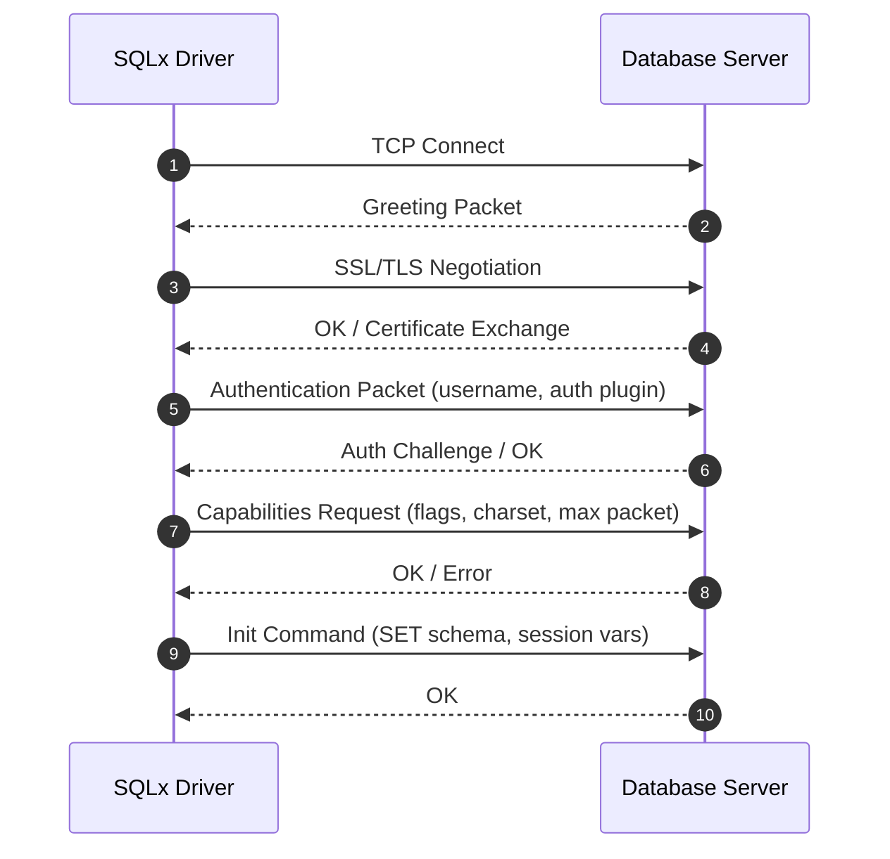
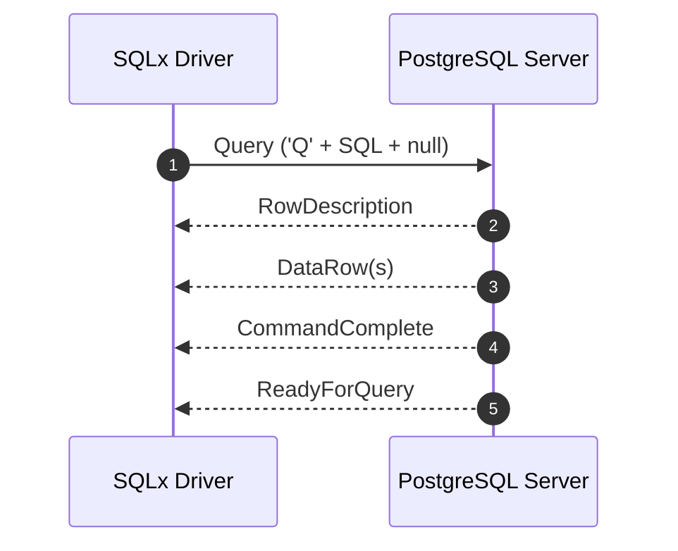
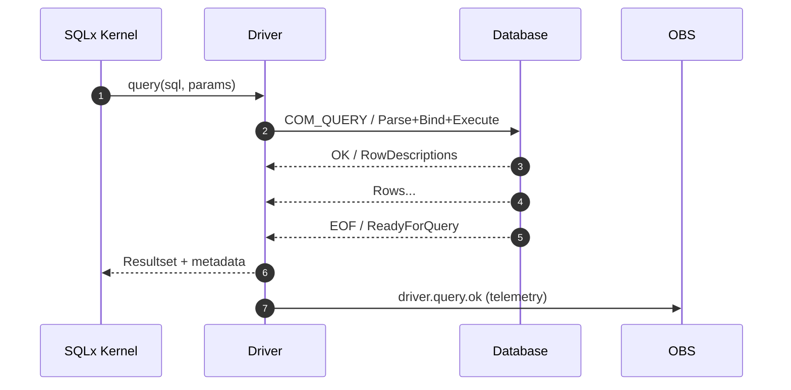

> **Purpose** — This document defines the wire-level protocol, handshake flow, packet formats, and state machines for native SQLx OS drivers for **MySQL** and **PostgreSQL**.  
> It provides the foundation for zero-dependency client communication, introspection, telemetry, and AI-assisted protocol adaptation.

---

# 1. Overview

SQLx OS implements its own **from-scratch drivers** for major dialects, replacing third-party libraries.  
Each driver adheres to a common **Driver Interface Contract** (DIC), defined by the UDR.

```ts
export interface SqlxDriver {
  connect(url: string): Promise<Session>;
  handshake(): Promise<HandshakeResult>;
  query(sql: string, params?: any[]): Promise<QueryResult>;
  close(): Promise<void>;
  stats(): DriverStats;
}
```

| Protocol | Base | Transport | Encryption |
|:--|:--|:--|:--|
| **MySQL** | 5.7 – 9.x | TCP | TLS 1.2+ (via STARTTLS or direct) |
| **PostgreSQL** | 10 – 17 | TCP | TLS 1.3+ (via SSLRequest/Startup) |

---

# 2. Connection Handshake Flow



**Handshake Targets**
- Establish secure connection (TLS 1.3+)
- Negotiate protocol capabilities (compression, multi-result, session tracking)
- Bind authentication plugin (MySQL: `caching_sha2_password`, PG: `SCRAM-SHA-256`)
- Emit `driver.handshake.ok` telemetry event

---

# 3. MySQL Wire Protocol (Core Packets)

### 3.1 Greeting Packet

| Field | Bytes | Description |
|:--|:--|:--|
| Protocol version | 1 | Usually `0x0A` |
| Server version string | NUL-terminated | e.g. "9.2.0-sqlx" |
| Connection ID | 4 | Session thread ID |
| Auth seed (part 1) | 8 | Random salt |
| Filler | 1 | 0x00 |
| Capability flags (lower) | 2 | Server-supported flags |
| Charset | 1 | Default charset |
| Status flags | 2 | Server status |
| Capability flags (upper) | 2 | Extended capabilities |
| Auth seed (part 2) | 12 | Random salt (continuation) |
| Auth plugin name | VarString | e.g., "caching_sha2_password" |

### 3.2 Authentication Packet

| Field | Type | Description |
|:--|:--|:--|
| client_flags | uint32 | Capabilities requested |
| max_packet_size | uint32 | Client maximum packet size |
| charset | uint8 | UTF8MB4 |
| username | string(NUL) | User |
| auth_response | string | Hashed challenge |
| database | string(NUL) | Default schema |

**Auth flow:**  
`auth_response = SHA256(SHA256(password) XOR SHA256(salt + SHA256(SHA256(password))))`

---

# 4. PostgreSQL Wire Protocol (Startup & Query)

### 4.1 Startup Message

| Field | Bytes | Description |
|:--|:--|:--|
| Length | 4 | Message length |
| Protocol Version | 4 | 196608 (3.0) |
| Parameters | Key/Value pairs | `user`, `database`, `client_encoding`, etc. |

### 4.2 Authentication Exchange

- Server may send:
  - `AuthenticationOk`
  - `AuthenticationCleartextPassword`
  - `AuthenticationMD5Password`
  - `AuthenticationSASL` (SCRAM-SHA-256)

### 4.3 Query Flow



### 4.4 Extended Query Protocol (prepared)

| Message | Direction | Purpose |
|:--|:--|:--|
| `Parse` | → | Prepare a statement |
| `Bind` | → | Bind parameters |
| `Describe` | → | Retrieve metadata |
| `Execute` | → | Run prepared query |
| `Sync` | → | End of command |
| `RowDescription` | ← | Column info |
| `DataRow` | ← | Row data |

---

# 5. Packet Encoding (Common)

```ts
export interface Packet {
  header: {
    sequenceId: number;
    length: number;
  };
  payload: Uint8Array;
}
```

- **Length:** 3-byte little-endian (MySQL) or 4-byte big-endian (PG)  
- **Compression:** optional (`COMPRESS=1`)  
- **Checksum:** optional CRC32 per frame  
- **Framing:** contiguous packet stream; fragments reassembled in buffer pool.

---

# 6. Statement Execution Lifecycle



**Telemetry Events**
- `driver.connect.start|ok|error`
- `driver.query.start|ok|error`
- `driver.result.rows`
- `driver.error.protocol|auth|timeout`
- `driver.stats.emit`

---

# 7. Observability Integration

Every driver maintains:
- Connection pool metrics (`active`, `idle`, `waiting`)  
- Per-query latency histograms  
- Error counters by class (auth, timeout, I/O, parse)  
- TLS handshake metrics  
- Bytes in/out counters (for cost analytics)

Mapped to OTel:
```
metric: sqlx_driver_connections{dialect}
metric: sqlx_driver_latency_ms{dialect, type}
metric: sqlx_driver_errors_total{dialect, class}
```

---

# 8. Security & Hardening

- **TLS required** by default; downgrade refused unless `--unsafe-no-tls` flag used in dev mode.  
- **Client random** generated via `crypto.getRandomValues`.  
- **Auth replay protection** enforced via nonce expiration.  
- **No plain-text passwords** in memory after handshake.  
- **Query sanitization** enforced by UDR layer — parameter binding mandatory.  
- **Audit Events** for all handshakes, failures, and retries.  

---

# 9. AI-Assisted Protocol Learning

The AI Fabric observes wire telemetry to:
- Learn latency/failure correlations by opcode  
- Predict protocol errors and suggest reconnection strategies  
- Auto-tune batch sizes and keepalive intervals  
- Suggest dialect-specific optimizations (`use binary protocol`, `pipeline mode`)  

Telemetry schema extended with:
```json
{
  "op": "COM_QUERY",
  "latency_ms": 18,
  "bytes_sent": 121,
  "bytes_recv": 1053,
  "retry": false,
  "reward": -0.2
}
```

---

# 10. Future Extensions

| Extension | Purpose |
|:--|:--|
| **SQLite Local Transport** | In-memory + file I/O multiplexed driver |
| **Oracle/MSSQL Drivers** | Protocol 2-stage handshake reverse-engineered |
| **gRPC Transport Mode** | Alternative to TCP for mesh environments |
| **QUIC/TLS 1.3 0-RTT** | Next-gen low-latency transport |
| **WebSocket Multiplex Mode** | For Studio browser clients |

---

# 11. Open Questions

1. Should SQLx maintain a unified binary protocol for all dialects (SQLxWire)?  
2. Should AI Fabric directly mutate driver parameters (auto-tune)?  
3. Can telemetry compression be achieved via adaptive sampling?  
4. How to handle partial TLS renegotiation mid-session?  
5. Should packet parsers be generated from declarative schema (IDL)?  

---
