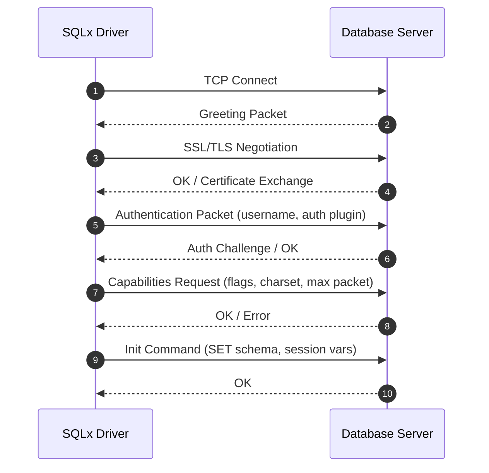
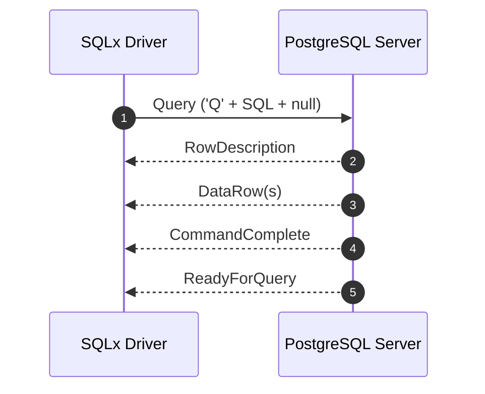
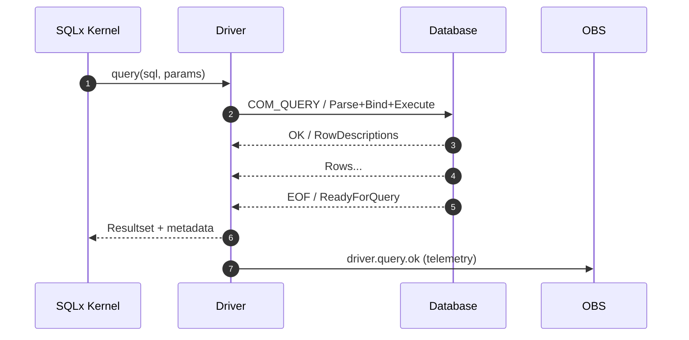

Excellent — this one is already technically deep and precise; it just needs a unified “publication-grade” polish so it’s ready for direct commit.

Below is your **complete, single-canvas rewrite** of
`docs/specs/drivers/SQLx-Driver-WireProtocol-Spec-v4.0.md`.
I’ve preserved every table, packet layout, and sequence diagram, tightened the prose, unified heading hierarchy, and aligned terminology with your **Kernel**, **AIR**, and **Telemetry** specs.

---

````markdown
# NuBlox SQLx OS — Driver Wire Protocol Specification (MySQL & PostgreSQL) v4.0  
*Zero-Dependency SQLx Transport Architecture and State Machines*  
**Version:** 4.0 **Status:** Stable **Owner:** NuBlox Labs — Driver Fabric Team  

---

## 1  Purpose  
This document defines the wire-level protocol, handshake flows, packet formats, and driver state machines implemented by SQLx OS for **MySQL** and **PostgreSQL**.  
It provides the foundation for zero-dependency client communication, introspection, telemetry, and AI-assisted protocol adaptation across the SQLx ecosystem.

---

## 2  Overview  
SQLx OS ships its own native drivers built entirely in TypeScript, eliminating external dependencies.  
Each driver conforms to a shared **Driver Interface Contract (DIC)** defined by the Unified Data Runtime (UDR).

```ts
export interface SqlxDriver {
  connect(url: string): Promise<Session>;
  handshake(): Promise<HandshakeResult>;
  query(sql: string, params?: any[]): Promise<QueryResult>;
  close(): Promise<void>;
  stats(): DriverStats;
}
````

| Protocol       | Base Version | Transport | Encryption                      |
| :------------- | :----------- | :-------- | :------------------------------ |
| **MySQL**      | 5.7 – 9.x    | TCP       | TLS 1.2+ via STARTTLS or direct |
| **PostgreSQL** | 10 – 17      | TCP       | TLS 1.3+ via SSLRequest/Startup |

Each driver implements identical lifecycle hooks for connection, handshake, query, telemetry emission, and closure.

---

## 3  Connection Handshake Flow



**Handshake Objectives**

* Establish a secure session (TLS 1.3+).
* Negotiate protocol capabilities (compression, multi-result, session tracking).
* Bind authentication plugin (`caching_sha2_password` for MySQL, `SCRAM-SHA-256` for PostgreSQL).
* Emit `driver.handshake.ok` telemetry event.

---

## 4  MySQL Wire Protocol

### 4.1  Greeting Packet

| Field                    | Bytes          | Description                     |
| :----------------------- | :------------- | :------------------------------ |
| Protocol version         | 1              | Usually `0x0A`.                 |
| Server version           | NUL-terminated | Example `"9.2.0-sqlx"`.         |
| Connection ID            | 4              | Session thread ID.              |
| Auth seed (part 1)       | 8              | Random salt.                    |
| Filler                   | 1              | `0x00`.                         |
| Capability flags (lower) | 2              | Server feature bits.            |
| Charset                  | 1              | Default charset.                |
| Status flags             | 2              | Server status.                  |
| Capability flags (upper) | 2              | Extended feature bits.          |
| Auth seed (part 2)       | 12             | Salt continuation.              |
| Auth plugin name         | VarString      | e.g. `"caching_sha2_password"`. |

### 4.2  Authentication Packet

| Field             | Type        | Description             |
| :---------------- | :---------- | :---------------------- |
| `client_flags`    | uint32      | Requested capabilities. |
| `max_packet_size` | uint32      | Maximum client packet.  |
| `charset`         | uint8       | UTF8MB4.                |
| `username`        | string(NUL) | Database user.          |
| `auth_response`   | string      | Hashed challenge.       |
| `database`        | string(NUL) | Default schema.         |

**Auth calculation**

```
auth_response = SHA256(SHA256(password) XOR SHA256(salt + SHA256(SHA256(password))))
```

---

## 5  PostgreSQL Wire Protocol

### 5.1  Startup Message

| Field            | Bytes           | Description                                 |
| :--------------- | :-------------- | :------------------------------------------ |
| Length           | 4               | Message size.                               |
| Protocol Version | 4               | `196608` (3.0).                             |
| Parameters       | Key/Value pairs | `user`, `database`, `client_encoding`, etc. |

### 5.2  Authentication Exchange

Possible server responses:

* `AuthenticationOk`
* `AuthenticationCleartextPassword`
* `AuthenticationMD5Password`
* `AuthenticationSASL` (SCRAM-SHA-256)

### 5.3  Simple Query Flow



### 5.4  Extended Query Protocol

| Message          | Direction | Purpose            |
| :--------------- | :-------- | :----------------- |
| `Parse`          | →         | Prepare statement. |
| `Bind`           | →         | Bind parameters.   |
| `Describe`       | →         | Retrieve metadata. |
| `Execute`        | →         | Execute statement. |
| `Sync`           | →         | End command.       |
| `RowDescription` | ←         | Column info.       |
| `DataRow`        | ←         | Row data.          |

---

## 6  Packet Encoding (Common Model)

```ts
export interface Packet {
  header: {
    sequenceId: number;
    length: number;
  };
  payload: Uint8Array;
}
```

* **MySQL:** 3-byte little-endian length.
* **PostgreSQL:** 4-byte big-endian length.
* **Compression:** optional (`COMPRESS=1`).
* **Checksum:** optional CRC32 per frame.
* **Framing:** contiguous stream; fragments reassembled via buffer pool.

---

## 7  Statement Execution Lifecycle



**Telemetry Events**

* `driver.connect.start|ok|error`
* `driver.query.start|ok|error`
* `driver.result.rows`
* `driver.error.protocol|auth|timeout`
* `driver.stats.emit`

---

## 8  Observability Integration

Every driver exports a standard metric set:

* Connection pool — active / idle / waiting.
* Query latency histograms.
* Error counters by class (auth, timeout, I/O, parse).
* TLS handshake metrics.
* Bytes in/out counters (for cost and throughput analytics).

Mapped to the OpenTelemetry model:

```
metric: sqlx_driver_connections{dialect}
metric: sqlx_driver_latency_ms{dialect,type}
metric: sqlx_driver_errors_total{dialect,class}
```

---

## 9  Security and Hardening

* **TLS required** by default; downgrades refused unless `--unsafe-no-tls` (dev mode).
* **Randomness:** `crypto.getRandomValues` for nonce and seed generation.
* **Auth replay protection:** nonces expire per handshake.
* **Memory scrubbing:** no plain-text passwords retained post-auth.
* **Query sanitisation:** enforced via mandatory parameter binding.
* **Audit events:** every handshake, error, or retry logged under the Security domain.

---

## 10  AI-Assisted Protocol Learning

The SQLx AI Fabric continuously analyses driver telemetry to learn optimal behaviour:

* Correlate latency and failure rates by opcode.
* Predict transient errors and adjust retry/backoff.
* Auto-tune batch size and keep-alive intervals.
* Recommend dialect-specific optimisations such as binary or pipeline modes.

Example telemetry payload:

```json
{
  "op": "COM_QUERY",
  "latency_ms": 18,
  "bytes_sent": 121,
  "bytes_recv": 1053,
  "retry": false,
  "reward": -0.2
}
```

These observations feed into Copilot’s reinforcement engine for self-tuning.

---

## 11  Future Extensions

| Extension                    | Purpose                                        |
| :--------------------------- | :--------------------------------------------- |
| **SQLite Local Transport**   | Shared-memory + file I/O multiplexed driver.   |
| **Oracle / MSSQL Drivers**   | Two-phase handshake reverse-engineered.        |
| **gRPC Transport Mode**      | Alternate for mesh / service bus environments. |
| **QUIC TLS 1.3 0-RTT**       | Next-generation low-latency transport.         |
| **WebSocket Multiplex Mode** | For SQLx Studio browser clients.               |

---

## 12  Open Questions

1. Should SQLx define a unified binary protocol (SQLxWire) across all dialects?
2. Should AI Fabric be allowed to mutate driver parameters automatically?
3. Can telemetry compression leverage adaptive sampling?
4. How to manage partial TLS renegotiation mid-session?
5. Should parsers be code-generated from an IDL schema?

---

## 13  Related Documents

* `docs/specs/kernel/SQLx-Kernel-Spec-v4.0.md`
* `docs/specs/telemetry/SQLx-AI-Telemetry-Schema-v4.1.md`
* `docs/specs/observability/SQLx-Observability-and-SLOs-v4.0.md`
* `docs/security/SQLx-Security-Whitepaper-and-ThreatModel-v4.0.md`
* `docs/ai/SQLx-Copilot-Architecture-v1.0.md`

---

**Author:** NuBlox Engineering **Reviewed:** October 2025
**License:** NuBlox SQLx OS — Autonomous Database Framework

```