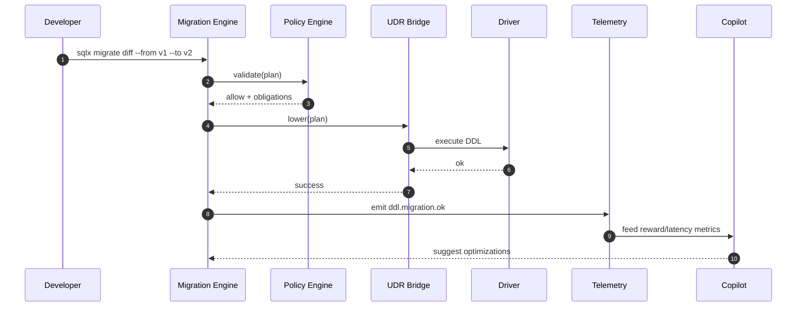

Perfect — continuing in the same world-class style, here’s a **complete, copy-paste-ready single-canvas** document for:

`docs/specs/migration/SQLx-Migration-and-DDL-Strategy-v4.0.md`

---

````markdown
# SQLx Migration and DDL Strategy v4.0  
*Deterministic Schema Evolution, Transactional DDL, and AI-Assisted Planning for SQLx OS*  
**Version:** 4.0 **Status:** Stable **Owner:** NuBlox Labs — Schema & Runtime Team  

---

## Executive Summary  
SQLx OS treats schema evolution as a **first-class, versioned process**—not a side effect of manual scripts.  
The Migration Engine ensures that all DDL operations are **deterministic**, **transactional**, and **auditable**, while remaining dialect-agnostic through the Abstract Intermediate Representation (AIR).  
By coupling migrations with Telemetry, Policy, and AI Fabric (AIF), SQLx provides a continuous feedback loop where schema change, performance, and governance evolve in synchrony.  

---

## 1  Purpose  
- Define a unified, AI-aware migration framework across MySQL, PostgreSQL, and future dialects.  
- Provide safe DDL orchestration with transactional rollback and online upgrades.  
- Embed observability, policy compliance, and trace lineage into every schema change.  
- Eliminate human guesswork: allow Copilot to propose, simulate, and verify migrations automatically.

---

## 2  Architectural Overview  

```mermaid
flowchart LR
    subgraph Kernel
      MIG[Migration Engine]
      CMP[Comparator]
      AIR[AIR Normalizer]
      DDL[DDL Planner]
      UDR[UDR Bridge]
      OBS[Telemetry/Policy Hooks]
    end

    SRC[Source Schema Snapshot] --> CMP
    TGT[Target Schema Definition] --> CMP
    CMP -->|diff| MIG
    MIG --> AIR --> DDL --> UDR
    MIG --> OBS
    OBS -->|events| Copilot[(AI Fabric)]
````

**Core Flow**

1. Capture source and target schema snapshots.
2. Normalize both into AIR Schema Graphs.
3. Compute deterministic diff → Migration Plan.
4. Validate via Policy & Compliance engine.
5. Execute plan transactionally via UDR/Driver.
6. Emit Telemetry & AI feedback for tuning.

---

## 3  Schema Model (AIR-DDL)

Every schema element (table, column, index, FK, view, trigger) maps to an **AIR DDL node**.

| Entity       | Primary Keys    | Example Attributes                                     |
| :----------- | :-------------- | :----------------------------------------------------- |
| `Table`      | `schema + name` | `engine`, `charset`, `comment`, `tags`                 |
| `Column`     | `table + name`  | `type`, `nullable`, `default`, `autoIncrement`, `tags` |
| `Index`      | `table + name`  | `columns`, `unique`, `type`                            |
| `ForeignKey` | `table + name`  | `refTable`, `refColumns`, `onDelete`, `onUpdate`       |
| `View`       | `schema + name` | `definition`, `securityBarrier`, `checkOption`         |

AIR-DDL Graph ensures dialect neutrality; e.g. `AUTO_INCREMENT` ↔ `SERIAL` normalized.

---

## 4  Migration Plan Structure

```ts
export interface MigrationPlan {
  id: string;                  // mig:<hash>
  from: string;                // baseline snapshot id
  to: string;                  // target snapshot id
  steps: MigrationStep[];
  transactional: boolean;
  createdAt: string;
  author: string;
  verified?: boolean;
}

export interface MigrationStep {
  id: string;
  op: "create"|"alter"|"drop"|"rename";
  entity: "table"|"column"|"index"|"foreignKey"|"view";
  ddl: string;                 // dialect-specific SQL
  airDiff?: any;               // AIR representation
  policyTags?: Record<string,string>;
  reversible?: boolean;
}
```

---

## 5  Diff Engine

### 5.1  Comparison Algorithm

1. **Normalize** both schemas into canonical AIR Graphs.
2. **Hash** each entity into a stable 64-bit digest of its normalized form.
3. **Compare** hashes → generate `create/alter/drop` operations.
4. **Reconcile** name and type equivalences via dialect mapping.
5. **Annotate** diffs with tags for policy and telemetry.

### 5.2  Sample Diff Table

| Type       | Source          | Target          | Operation | Notes                            |
| :--------- | :-------------- | :-------------- | :-------- | :------------------------------- |
| Table      | users           | users           | alter     | add column `last_login` DATETIME |
| Column     | users.email     | users.email     | same      | no change                        |
| Index      | idx_users_email | idx_users_email | same      | unique                           |
| ForeignKey | fk_orders_users | fk_orders_users | drop      | ref table removed                |

---

## 6  Execution Engine

* Executes DDL plans **transactionally** where supported (PostgreSQL).
* For MySQL, wraps DDL in pseudo-transaction with recovery table.
* Uses **two-phase apply**:

  * *Phase 1*: Validate (dry-run, lock check, foreign key constraints).
  * *Phase 2*: Apply (execute, record, emit telemetry).

**Safety Heuristics**

| Check                   | Enforcement                         |
| :---------------------- | :---------------------------------- |
| Dependent view/function | topological order resolution        |
| Long-running alter      | online algorithm or shadow-table    |
| Column shrink           | flagged as risk; requires `--force` |
| Foreign key cascade     | explicit confirmation               |
| Non-reversible ops      | require approval token              |

---

## 7  Rollback & Recovery

Each migration produces a **rollback plan** when possible.
Rollback steps mirror original ops in reverse order; logged in a ledger table:

```sql
CREATE TABLE IF NOT EXISTS sqlx_migration_ledger (
  id VARCHAR(64) PRIMARY KEY,
  tenant VARCHAR(64),
  from_version VARCHAR(64),
  to_version VARCHAR(64),
  applied_by VARCHAR(64),
  applied_at TIMESTAMP,
  rollback_plan JSON,
  status ENUM('applied','rolled_back','failed'),
  signature CHAR(64)
);
```

Rollback execution validated by policy engine and signed before application.

---

## 8  Online Migration Strategies

| Strategy                  | Use Case             | Mechanism                                            |
| :------------------------ | :------------------- | :--------------------------------------------------- |
| **Shadow Table Swap**     | Large tables         | Create new table, copy data async, swap atomically   |
| **Partition Add/Drop**    | Time-based retention | Non-blocking partition operations                    |
| **Column Add Nullable**   | Schema evolution     | Lock-free, metadata-only                             |
| **View Replace**          | Analytics refresh    | Replace definition atomically                        |
| **Dual-Write Transition** | Re-platforming       | Write to old/new table simultaneously until verified |

All strategies configurable via `migration.strategy` and integrated with scheduler for throttled execution.

---

## 9  Policy & Compliance Integration

* **Tag Enforcement**: residency, sensitivity, retention attached to new columns/tables.
* **Approval Workflow**: migrations affecting PII or external egress require `policy.approval`.
* **Audit Hooks**: every DDL operation produces a signed `policy.event` for compliance logs.
* **Governance Metrics**: track approved vs. rejected migrations, pending obligations.

---

## 10  Telemetry and Observability

**Events**

* `ddl.migration.start|ok|error|rollback`
* `ddl.plan.diff` (before apply)
* `ddl.plan.verified` (post-AI validation)
* `ddl.rollback.ok|error`

**Metrics**

| Metric                         | Description                         |
| :----------------------------- | :---------------------------------- |
| `sqlx_migration_duration_ms`   | per step / total migration duration |
| `sqlx_migration_errors_total`  | count by class                      |
| `sqlx_migration_pending`       | count of unapplied plans            |
| `sqlx_migration_policy_denied` | blocked by compliance policy        |

**Example Telemetry Payload**

```json
{
  "trace_id": "mig-4a1b",
  "event": "ddl.migration.ok",
  "tenant": "acme",
  "plan_id": "mig:9f3a",
  "steps": 12,
  "duration_ms": 1024,
  "ai_verdict": "validated",
  "policy_result": "allow",
  "reward": +1.2
}
```

---

## 11  AI Copilot Integration

Copilot observes and learns from all schema diffs and outcomes.

**Capabilities**

* **Plan Synthesis**: generate migration plans from schema deltas or natural-language prompts.
* **Risk Estimation**: classify steps as *safe*, *risky*, or *experimental* using telemetry.
* **Self-Healing**: suggest rollbacks or new indexes when regression detected.
* **Policy Compliance**: predict required approvals based on prior patterns.
* **Plan Regression Testing**: simulate cost/latency impact before apply.

Reward signals feed into the AI Telemetry Schema (ATS) for reinforcement.

---

## 12  Configuration and CLI

**Example Config**

```yaml
migration:
  transactional: true
  verifyPolicy: true
  allowShadowTables: true
  autoRollback: false
  strategy: "online"
  ddlTimeoutSec: 120
  aiAssist: true
```

**CLI Commands**

| Command                               | Description                 |
| :------------------------------------ | :-------------------------- |
| `sqlx migrate diff --from v1 --to v2` | Generate migration plan     |
| `sqlx migrate apply --plan plan.json` | Apply migration plan        |
| `sqlx migrate rollback --id mig:abcd` | Roll back migration         |
| `sqlx migrate verify`                 | Validate plan via Policy/AI |
| `sqlx migrate list`                   | List applied migrations     |

All CLI commands invoke Kernel APIs and emit telemetry.

---

## 13  Security and Hardening

* **Signature Verification**: every plan file is SHA-256 signed; unsigned plans rejected.
* **Immutable Ledger**: append-only `sqlx_migration_ledger`.
* **RBAC Hooks**: only roles with `role:data.steward` or higher can execute DDL.
* **Sensitive Data Redaction**: never log full DDL containing PII column names.
* **TLS/mTLS**: enforced for remote execution via UDR.
* **Recovery Mode**: fallback if ledger mismatch detected; requires human approval.

---

## 14  Performance Targets

| Metric                       | Target               | Notes                      |
| :--------------------------- | :------------------- | :------------------------- |
| Plan diff latency            | < 500 ms             | schemas ≤ 2000 objects     |
| Apply throughput             | ≥ 200 DDL ops/minute | online mode                |
| Rollback success             | ≥ 99.5 %             | validated rollback scripts |
| Policy evaluation latency    | < 2 ms               | per DDL step               |
| Migration telemetry emission | 100 %                | no drop                    |

---

## 15  Example — End-to-End Lifecycle



---

## 16  Open Questions (RFCs)

1. Should migrations adopt a **binary AIR-DDL format** for faster diffing?
2. Can Copilot auto-rollback based on live telemetry thresholds?
3. Should PPC integrate schema epoch hints to avoid stale plans?
4. How to define **federated migration orchestration** for multi-tenant clusters?
5. What’s the minimal safe DDL subset for “instant apply” mode?

---

## 17  Related Documents

* `docs/specs/kernel/SQLx-Kernel-Spec-v4.0.md`
* `docs/specs/air/SQLx-AIR-Spec-v4.0.md`
* `docs/specs/policy/SQLx-Policy-Graph-and-RBAC-v4.0.md`
* `docs/specs/telemetry/SQLx-AI-Telemetry-Schema-v4.1.md`
* `docs/specs/observability/SQLx-Observability-and-SLOs-v4.0.md`
* `docs/ai/SQLx-Copilot-Architecture-v1.0.md`

---

**Author:** NuBlox Engineering **Reviewed:** October 2025
**License:** NuBlox SQLx OS — Autonomous Database Framework

```