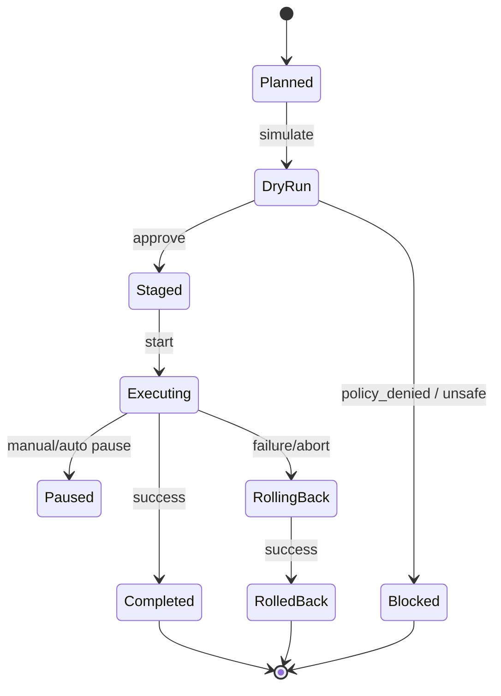

> **Purpose** — Define SQLx OS’s strategy for **online, safe, explainable schema change** across heterogeneous dialects.  
> The Kernel orchestrates **micro-migrations**, minimizes lock impact, enforces **policy gates**, provides **automatic rollback**, and emits **auditable evidence**.

---

# 1. Principles

1. **Online-first**: changes must not disrupt OLTP workloads.  
2. **Atomic at user-level**: expose a single “migration” while executing multiple micro-steps.  
3. **Dialect-aware**: use engine-native online features; emulate where required.  
4. **Safe-by-default**: policy gates (π) and dry-runs precede execution.  
5. **Deterministic & auditable**: every step logged with trace + ledger signature.  
6. **Reversible**: bounded, automated rollback for most structural changes.

---

# 2. Migration Types (Canonical)

| Type | Examples | Online Strategy |
|:--|:--|:--|
| **Additive** | add column (nullable), add index, add table | fully online |
| **Backfill** | add column with derived default | shadow + background backfill |
| **Rewrite** | change type, rename, split/merge tables | dual-write + cutover |
| **Constraint** | add FK/unique/check | online if supported; otherwise shadow verify |
| **Destructive** | drop column/table, remove index | grace period + archive + approvals |

---

# 3. Lifecycle & State Machine



**Artifacts**
- **Plan**: list of micro-steps with safety notes.  
- **Evidence**: impact estimates (row counts, lock risk, time).  
- **Approvals**: sign-offs recorded in ledger.  
- **Cutover token**: for manual or auto cutover.

---

# 4. Micro-Migration Patterns

## 4.1 Add Column with Backfill (safe)
**Goal**: add `users.country_code` populated from `addresses.country`.

Steps:
1. **Add nullable column** (online).  
2. **Backfill in batches** with throttling and scheduler class **B**.  
3. **Add check constraint / default** (dialect-aware).  
4. **Flip application read path** (feature flag).  
5. **Make column NOT NULL** (only after backfill verified).

## 4.2 Rename Column (dual-path)
Steps:
1. **Add new column**.  
2. **Dual-write** via triggers or app-layer hook.  
3. **Backfill historical rows**.  
4. **Cutover reads** to new column.  
5. **Drop old column** after grace period.

## 4.3 Index Add (concurrent/online)
- PostgreSQL: `CREATE INDEX CONCURRENTLY` (no exclusive lock).  
- MySQL/InnoDB: `ALGORITHM=INPLACE, LOCK=NONE` where supported; otherwise **shadow index** build.

## 4.4 Table Rewrite (shadow + swap)
- Create **shadow table** with desired schema.  
- **Dual-write** through UDR-generated triggers (or app hook).  
- Backfill via chunked copy with checksums.  
- **Swap** (rename/swap partitions) atomically during low-traffic window.  
- Validate via **post-cutover consistency check**.

---

# 5. Safety Gates (π + Kernel)

| Gate | Check |
|:--|:--|
| **Lock Risk** | estimates from stats (row count, index size, engine capability) |
| **Policy** | residency, PII impact, approval requirements |
| **SLO** | predicted latency impact < budget |
| **Capacity** | storage headroom, replica lag tolerance |
| **Conflicts** | concurrent migrations on same resources blocked |
| **Rollbackability** | prepare reverse plan (where possible) |

**Dry-Run** simulates plan on snapshot of catalog and stats; emits an “impact report”.

---

# 6. Dialect Playbooks

## 6.1 PostgreSQL
- Prefer `CREATE INDEX CONCURRENTLY`, `ALTER TABLE ... ADD COLUMN` (fast).  
- Type changes: `USING` clause with expression; use shadow-rewrite for large tables.  
- Avoid long `VACUUM FREEZE` during peak; schedule with class **S**.  
- Row-level backfill via `UPDATE ... WHERE id BETWEEN ...` with `ANALYZE` pacing.

## 6.2 MySQL (InnoDB)
- Use `ALGORITHM=INPLACE, LOCK=NONE` where engine supports; else **pt-online-schema-change** equivalent via shadow-copy.  
- Beware large secondary index rebuilds (I/O).  
- For FK adds, lock windows may be required; coordinate cutover tokens.  
- Monitor replica lag; throttle backfill when lag > threshold.

## 6.3 SQLite (local/edge)
- Limited online DDL; use **copy-table** strategy and WAL mode.  
- Enforce small batch backfills to keep UI responsive on edge devices.

---

# 7. Backfill Engine

**Scheduler Class**: **B** (bulk).  
**Chunking**: adaptive chunk sizes targeting p95 chunk time ≈ 100–300ms.  
**Throttling**: PID control on latency/error feedback.  
**Idempotency**: write markers to resume after failure.  
**Observability**:
- `migration.backfill.progress{table}` (% complete)  
- `migration.lag.ms` (replica lag)  
- `migration.errors_total`

---

# 8. Cutover Strategies

| Strategy | Use Case | Notes |
|:--|:--|:--|
| **Auto-cutover** | Low risk, verified backfill | Kernel triggers at SLO-safe window |
| **Manual token** | High risk or governance-required | Requires approver action (Studio/API) |
| **Blue/Green** | Large rewrites | Route read/write gradually via router |
| **Canary Tenants** | Multi-tenant | Enable per-tenant with feedback loop |

Post-cutover: enable **read-after-write consistency checks** and **shadow reads** for a window.

---

# 9. Rollback Strategy

- **Additive**: drop column/index/table (if unused) — automatic.  
- **Backfill**: revert read path, mark column nullable — automatic.  
- **Rewrite**: swap back to original, replay delta log — guarded.  
- **Constraint**: disable constraint, queue remediation job — guarded.

**Trigger:** error budget burn, latency spike, or correctness alert.  
**RPO/RTO Targets**: RPO ≤ 1 min (dual-write delta), RTO ≤ 5 min for swap.

---

# 10. Evidence & Audit

Ledger entries include:
- migration id, author, approvals, policy packs, risk class  
- plan hash, micro-step list, checksums, row counts  
- start/stop times, cutover token, success/failure  
- rollback details if invoked

Export formats: JSON, CSV; signed with content hash.

---

# 11. Developer Workflow

```mermaid
flowchart LR
    Dev[Developer] --> MR[RFC/Migration PR]
    MR --> CI[Dry-Run + Impact Report]
    CI --> PAP[Policy Admin (PAP) Approvals]
    PAP --> CP[SQLx Control Plane]
    CP --> Exec[Execute Micro-Migrations]
    Exec --> Cut[Cutover (auto/manual)]
    Cut --> Ver[Post-Checks + Evidence]
```

**CLI Skeleton**
```bash
sqlx migrate plan migrations/2025-10-16-add-country-code.yaml
sqlx migrate dry-run --workspace prod-eu
sqlx migrate approve --policy-pack gdpr
sqlx migrate execute --auto
sqlx migrate cutover --token <id>
sqlx migrate evidence --export ledger.json
```

---

# 12. Config Examples

```yaml
sqlx:
  migration:
    backfill:
      targetChunkMs: 200
      maxConcurrency: 8
      maxReplicaLagMs: 3000
    cutover:
      window: "02:00-04:00 Europe/London"
      auto: true
    safety:
      requireApprovals: ["role:dba_admin","role:dpo"]
      destructiveGraceDays: 14
```

---

# 13. SLOs & Alerts

| Metric | SLO | Alert |
|:--|:--|:--|
| Backfill p95 chunk | 300 ms | > 700 ms 10m → throttle |
| Replica lag | < 3 s | > 10 s 5m → pause backfill |
| Error rate | < 0.5% | > 1% 5m → rollback eval |
| Cutover duration | < 120 s | > 300 s → investigate |

---

# 14. Open Questions

1. Provide **generated triggers** vs app-layer dual-write — default policy?  
2. Add **online check constraint validation** via shadow index scan?  
3. Expose a **what-if sandbox** that replays production traces on a twin cluster?

---
