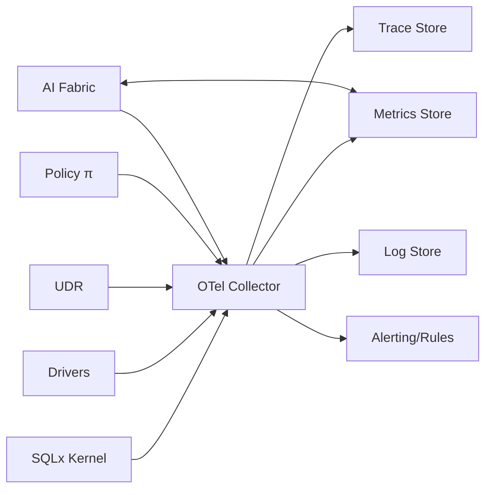
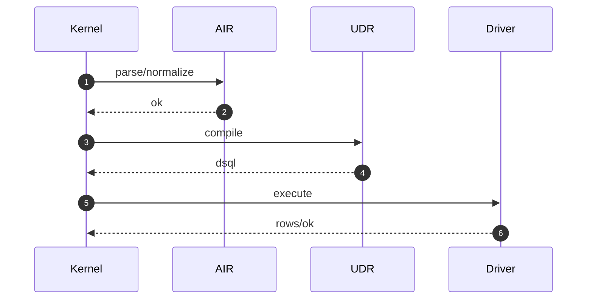

> **Purpose** — Define the **observability model** (traces, metrics, logs), **service level indicators (SLIs)**, **service level objectives (SLOs)**, alert policies, and dashboards for SQLx OS v4.0.  
> This spec aligns with the **AI Telemetry Schema (ATS)** and mandates OpenTelemetry (OTel) semantics across all subsystems.

---

# 1. Architecture Overview



**Stores**: Prometheus (metrics), Tempo/Jaeger (traces), Loki/OpenSearch (logs).  
**Dashboards**: Grafana (kernel/driver/policy/AI).

---

# 2. Namespacing & Conventions

- **Resource attributes**: `service.name=sqlx-kernel|sqlx-driver|sqlx-udr|sqlx-policy|sqlx-studio`  
- **Span names**: `{subsys}.{op}` (e.g., `driver.query`, `udr.compile`, `policy.evaluate`)  
- **Metrics**: `sqlx_{subsys}_{metric}` (snake_case)  
- **Labels**: `{dialect, workspace, tenant, region, class (L/B/A/S), version}`

---

# 3. SLIs & SLOs by Subsystem

## 3.1 Kernel

**SLIs**
- `exec_latency_ms{class}` (histogram)  
- `sched_preemptions_total{class}`  
- `cache_hit_ratio{kind}` (gauge)  
- `errors_total{class}` (counter)

**SLOs**
- p95 `exec_latency_ms{class=L}` < **15 ms** (steady state)  
- p95 `exec_latency_ms{class=B}` < **200 ms**  
- p95 `exec_latency_ms{class=A}` < **1500 ms**  
- `cache_hit_ratio{ppc}` > **0.35**

## 3.2 Driver

**SLIs**
- `driver_latency_ms{op}` (handshake/query/prepare)  
- `driver_errors_total{class}` (auth/protocol/timeout)  
- `driver_pool_active|idle|waiting`

**SLOs**
- p95 handshake < **120 ms** (WAN), < **20 ms** (LAN)  
- error rate < **0.1%** per 5-min window

## 3.3 UDR

**SLIs**
- `udr_compile_ms` (AIR→SQL)  
- `udr_reverse_ms` (SQL→AIR)  
- `udr_emulation_used_total`

**SLOs**
- p95 compile < **5 ms**; reverse < **10 ms**  
- emulation success rate > **99.5%**

## 3.4 Policy (π)

**SLIs**
- `policy_eval_ms`  
- `policy_denies_total{reason}`  
- `approval_pending{count}`

**SLOs**
- p95 evaluation < **3 ms** (cached) / < **10 ms** (cold)  
- approval median < **2 min** (org-configurable)

## 3.5 AI Fabric

**SLIs**
- `reward_events_total`  
- `model_inference_ms{agent}`  
- `explainability_generated_total`

**SLOs**
- p95 inference < **20 ms** (online path)  
- reward backlog < **1000** events per workspace

---

# 4. Metric Catalogue (Prometheus)

```text
# Kernel
sqlx_exec_latency_ms_bucket
sqlx_sched_preemptions_total
sqlx_cache_hit_ratio

# Drivers
sqlx_driver_latency_ms_bucket{op="query"}
sqlx_driver_errors_total{class}
sqlx_driver_pool_active
sqlx_driver_pool_waiting

# UDR
sqlx_udr_compile_ms_bucket
sqlx_udr_reverse_ms_bucket
sqlx_udr_emulation_used_total

# Policy
sqlx_policy_eval_ms_bucket
sqlx_policy_denies_total{reason}

# AI
sqlx_ai_inference_ms_bucket{agent}
sqlx_ai_reward_events_total
```

---

# 5. Logging (Loki/OpenSearch)

- **Structure**: JSON lines with ATS envelope.  
- **Levels**: `INFO` (normal), `WARN` (recoverable), `ERROR` (user-visible), `SECURITY` (policy/ledger).  
- **PII Redaction**: enforced at source; test with redact e2e suite.

**Example (driver timeout)**
```json
{"ts":"2025-10-16T12:01:05Z","level":"ERROR","evt":"driver.query.error","dialect":"mysql","latency_ms":3001,"timeout":true,"trace_id":"4a1b..."}
```

---

# 6. Tracing (Tempo/Jaeger)

- **Parenting**: `kernel.exec` → `air.parse` → `udr.compile` → `driver.query`.  
- **Baggage**: `tenant`, `workspace`, `region`, `dialect`, `air_id`, `plan_hash`.  
- **Tail Sampling**: retain slow (>p95) or erroneous spans at 100%.



---

# 7. Alert Policies (SRE)

| Alert | Condition | Severity | Action |
|:--|:--|:--|:--|
| **DriverTimeoutBurst** | `sqlx_driver_errors_total{class="timeout"} rate > 0.5/s` for 5m | P1 | page on-call, failover routing |
| **KernelLatencyHigh** | p95 `sqlx_exec_latency_ms{class=L} > 50ms` for 10m | P2 | scale pools, inspect PPC |
| **PolicyDeniesSpike** | `sqlx_policy_denies_total` 10x baseline | P2 | check recent policy changes |
| **UDRCompileSlow** | p95 `sqlx_udr_compile_ms > 15ms` for 10m | P3 | inspect AIF hints |
| **AIBacklogHigh** | reward backlog > 1000 for 15m | P3 | scale consumers |

**Runbook links**: `/docs/ops/runbooks/RUNBOOK-kernel.md` etc.

---

# 8. Dashboards (Grafana)

- **Executive**: uptime, error rate, latency p95/p99, top tenants.  
- **Kernel**: class latencies, scheduler preemptions, PPC hit, cache size.  
- **Driver**: pool utilization, error classes, TLS handshakes, bytes.  
- **Policy**: denies by reason, eval latency, approvals pending.  
- **AI**: inference latency, model versions, reward rate.

---

# 9. Sampling & Cost Control

- **Tail-based sampling** for tracing (retain top 5% slowest).  
- **Dynamic metrics downsampling** by workspace size.  
- **Log sampling** caps noisy repeat errors.  
- **Learning budget** caps rewards per tenant/day.

---

# 10. Benchmarks & Golden Scenarios

Define reproducible scenarios for CI/CD and release gates:

| Scenario | Workload | Target |
|:--|:--|:--|
| **OLTP-PointRead** | 95% reads, 5% writes, 200 RPS | p95 < 15 ms |
| **Bulk-Insert** | 10k rows/min | p95 < 200 ms |
| **Analytics-Scan** | 10M rows, 3 joins | p95 < 1500 ms |
| **Migration-Online** | Add column online | zero failed queries |
| **Policy-Spike** | 10x denies spike | no kernel degradation |

Bench scripts live in `/bench/` with k6/Vegeta + SQL workloads.

---

# 11. CI Conformance

- **Metrics presence**: scrape test validates all core metrics exist.  
- **Trace shape**: golden traces compared against schema.  
- **Alert dry-run**: rule evaluation in CI with synthetic data.  
- **Dashboard JSON**: linting & UID pinning for portability.

---

# 12. Security & Privacy

- mTLS from producers to OTel collector.  
- Token-scoped access to dashboards (per-tenant where applicable).  
- No raw PII in spans/logs; test with synthetic payloads.  
- Audit events shipped to immutable ledger in parallel.

---

# 13. Open Questions

1. Adopt RED metrics (Rate, Errors, Duration) standard dashboards by default?  
2. Expose per-tenant SLO overlays in Studio?  
3. Enable “SLO error budget burn-rate” alerts out-of-the-box?

---
