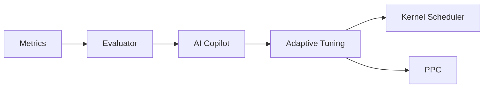

Excellent — this completes the “runtime intelligence core” (Kernel + Telemetry + UDR + Observability).
Here’s your **full, single-canvas, copy-paste-ready** version for:

`docs/specs/observability/SQLx-Observability-and-SLOs-v4.0.md`

---

````markdown
# SQLx Observability and SLOs v4.0  
*Unified Telemetry, Metrics, and Service-Level Objectives for the SQLx Operating System*  
**Version:** 4.0 **Status:** Stable **Owner:** NuBlox Labs — Observability & Reliability Engineering  

---

## Executive Summary  
Observability in SQLx OS is not an afterthought—it is the **nervous system** of the platform.  
Every query, plan, migration, or policy event emits structured telemetry through the **Telemetry Kernel Bus (TKB)** and is analyzed for **Service-Level Objectives (SLOs)**, **anomaly detection**, and **AI feedback**.  
This document defines the end-to-end model for metrics, traces, logs, alerting, and reliability targets that underpin the self-driving behaviour of SQLx OS.

---

## 1  Purpose  
- Provide a vendor-neutral, OpenTelemetry-aligned framework for all SQLx modules.  
- Define unified metric naming, trace semantics, and SLO objectives.  
- Enable AI-driven adaptation through Telemetry → Reward → Copilot loops.  
- Ensure compliance, audit, and resilience through deterministic evidence capture.  

---

## 2  Architectural Overview  

```mermaid
flowchart LR
    subgraph Kernel
      OBS[Telemetry Kernel Bus (TKB)]
      MET[Metrics Exporter]
      LOG[Structured Logs]
      TRC[Distributed Traces]
      AI[AI Reward Loop]
    end

    OBS --> MET
    OBS --> LOG
    OBS --> TRC
    TRC --> AI
    MET --> AI
    LOG --> AI
````

**Key Design Principles**

| Principle            | Description                                                                              |
| :------------------- | :--------------------------------------------------------------------------------------- |
| **Unified Envelope** | All observability data share the same correlation IDs (`trace_id`, `span_id`, `tenant`). |
| **OTel-Compatible**  | Standard OTel resource/schema with SQLx extensions.                                      |
| **AI-Aware**         | Metrics contain reward signals and context tags for Copilot training.                    |
| **Secure-by-Design** | No PII in telemetry; all artifacts signed and privacy-tagged.                            |

---

## 3  Telemetry Data Model

Each emission conforms to the **ATS (AI Telemetry Schema)** envelope.

```json
{
  "ts": "2025-10-17T09:00:00.000Z",
  "tenant": "acme",
  "workspace": "prod-eu",
  "trace_id": "4a1b...",
  "span_id": "9f3a...",
  "component": "kernel.scheduler",
  "event": "sqlx_driver_query_ok",
  "latency_ms": 12,
  "rows": 42,
  "reward": +1.2,
  "slo_class": "L",
  "policy_id": "pol:9f3a",
  "ai_meta": { "model": "copilot-v1", "epoch": 120 }
}
```

---

## 4  Trace Taxonomy

| Domain        | Example Spans                                        | Description                              |
| :------------ | :--------------------------------------------------- | :--------------------------------------- |
| **Kernel**    | `kernel.exec.start`, `kernel.cancel`, `kernel.retry` | Query lifecycle and scheduling decisions |
| **Driver**    | `driver.handshake`, `driver.query`, `driver.close`   | Transport-level telemetry                |
| **AIR/UDR**   | `air.plan`, `udr.lower`, `udr.route`                 | Compilation and routing phases           |
| **Policy**    | `policy.evaluate`, `policy.deny`                     | Authorization and obligations            |
| **Migration** | `ddl.migration.start`, `ddl.rollback.ok`             | DDL orchestration events                 |
| **AI**        | `ai.reward.emit`, `ai.model.update`                  | Feedback and reinforcement               |
| **Security**  | `sec.auth`, `sec.tls`, `sec.violation`               | Security and compliance signals          |

Traces are exported to the configured OTel Collector (Tempo/Jaeger) with full span context.

---

## 5  Metric Taxonomy

### 5.1  Counters

| Metric                         | Labels        | Description                          |
| :----------------------------- | :------------ | :----------------------------------- |
| `sqlx_driver_errors_total`     | dialect,class | Transport and protocol errors        |
| `sqlx_policy_denies_total`     | reason        | Access control denials               |
| `sqlx_cache_events_total`      | type          | Cache hits/misses/invalidations      |
| `sqlx_sched_preemptions_total` | class         | Preemption counts per workload class |
| `sqlx_migration_errors_total`  | type          | Failed DDL operations                |

### 5.2  Histograms

| Metric                       | Labels     | Unit | Description                      |
| :--------------------------- | :--------- | :--- | :------------------------------- |
| `sqlx_exec_latency_ms`       | class      | ms   | Query execution latency          |
| `sqlx_driver_latency_ms`     | dialect,op | ms   | Driver handshake/query latency   |
| `sqlx_air_compile_ms`        | phase      | ms   | AIR parse/plan/normalize latency |
| `sqlx_policy_eval_ms`        | -          | ms   | Policy decision time             |
| `sqlx_migration_duration_ms` | tenant     | ms   | Total migration duration         |

### 5.3  Gauges

| Metric               | Labels  | Description                      |
| :------------------- | :------ | :------------------------------- |
| `sqlx_pool_active`   | dialect | Active connections               |
| `sqlx_pool_idle`     | dialect | Idle connections                 |
| `sqlx_ppc_hit_ratio` | tenant  | Predictive Plan Cache efficiency |
| `sqlx_model_version` | agent   | AI model rollout version         |

---

## 6  Log Schema

Logs are structured JSON; never plain text.

**Example: Policy Denial**

```json
{
  "level": "warn",
  "ts": "2025-10-17T09:00:02Z",
  "component": "policy",
  "trace_id": "a1d4...",
  "event": "policy.deny",
  "actor": "user:analyst-42",
  "object": "db.public.users.email",
  "reason": "cross-region egress blocked",
  "obligations": ["mask:email"]
}
```

**Retention:** 30 days default; extended for compliance events.

---

## 7  SLO Framework

Each workload class (L/B/A/S) defines explicit SLO targets that Copilot monitors and optimizes.

| Class | Description      | p95 Latency | Availability | Error Rate (max) |
| :---- | :--------------- | :---------- | :----------- | :--------------- |
| **L** | Low-latency OLTP | < 15 ms     | ≥ 99.99 %    | ≤ 0.1 %          |
| **B** | Bulk ETL         | < 200 ms    | ≥ 99.9 %     | ≤ 0.5 %          |
| **A** | Analytics        | < 1.5 s     | ≥ 99.9 %     | ≤ 0.5 %          |
| **S** | System / DDL     | < 3 s       | ≥ 99.5 %     | ≤ 1 %            |

**Calculation**

```txt
Availability = 1 - (failed_requests / total_requests)
ErrorRate    = failed_spans / total_spans
Latency(p95) = percentile(latency_ms, 95)
```

SLOs are stored in `/etc/sqlx/slo.yml` and versioned per release.

---

## 8  Alerting & Reliability

### 8.1  Core Alerts

| Alert                    | Condition                                 | Action                               |
| :----------------------- | :---------------------------------------- | :----------------------------------- |
| **Driver Failure Spike** | `sqlx_driver_errors_total > 50 in 5m`     | Trigger failover, page on-call       |
| **Policy Denial Surge**  | `sqlx_policy_denies_total > baseline × 2` | Notify compliance                    |
| **PPC Regression**       | `sqlx_ppc_hit_ratio < 0.2`                | Trigger plan retraining              |
| **SLO Breach (L)**       | `p95_exec_latency_ms > 15`                | AI Copilot adjusts scheduler weights |
| **Telemetry Drop**       | Exporter error rate > 0.5 %               | Restart collector pipeline           |

### 8.2  Escalation Policy

* Level 1: AI Copilot auto-mitigation (tune weights, reroute).
* Level 2: On-call SRE human review.
* Level 3: Executive compliance report if persistent > 1 h.

---

## 9  AI Copilot Feedback Loop



**Feedback Sources**

| Source                       | Feature              | Reward Signal                  |
| :--------------------------- | :------------------- | :----------------------------- |
| `sqlx_exec_latency_ms`       | Scheduler latency    | Negative proportional to ms    |
| `sqlx_policy_denies_total`   | Compliance adherence | Neutral/positive if correct    |
| `sqlx_driver_errors_total`   | Reliability          | Negative proportional to count |
| `sqlx_migration_duration_ms` | Efficiency           | Positive if reduced            |
| `sqlx_ppc_hit_ratio`         | Plan reuse           | Positive if improved           |

Copilot learns optimal scheduler weights and query plans from reward deltas.

---

## 10  Benchmark & Test Methodology

* Synthetic workloads representing **L/B/A/S** profiles.
* 10 min steady-state runs per class under nominal and degraded conditions.
* Collect 100 % trace samples; compute SLO compliance ratios.
* Publish results to `docs/observability/Benchmark-Results-v4.0.md`.

---

## 11  Security & Privacy

* **Data Minimization**: telemetry strips SQL literals; stores only plan hashes.
* **PII Classification**: inherited from AIR tags → `sensitivity=pii|phi|none`.
* **Encryption**: mTLS → Collector; encrypted object storage (AES-256) for logs.
* **Access Control**: scopes `read:metrics`, `read:traces`, `read:logs`.
* **Anonymization**: optional token vault for reversible pseudonyms in dev.

---

## 12  Performance Targets

| Component                   | Metric     | Target   |
| :-------------------------- | :--------- | :------- |
| Telemetry emission overhead | CPU %      | < 3 %    |
| Trace export latency        | ms         | < 100 ms |
| Metric ingestion throughput | points/sec | ≥ 100 k  |
| Log write latency           | ms         | < 50 ms  |
| Reward propagation delay    | ms         | < 250 ms |

---

## 13  Configuration Example

```yaml
observability:
  otel:
    endpoint: http://otel:4317
    serviceName: sqlx-os
    sampling: 0.2
  slo:
    refreshSec: 60
    store: /etc/sqlx/slo.yml
  alerts:
    provider: pagerduty
  retention:
    traces: 30d
    metrics: 400d
    logs: 30d
```

Reloadable at runtime; validated by Kernel on startup.

---

## 14  Open Questions (RFCs)

1. Should Copilot enforce adaptive SLO budgets per tenant instead of global?
2. Can reward feedback train **anomaly classifiers** for pre-emptive scaling?
3. How to surface per-policy SLO dashboards in SQLx Studio?
4. Should we embed PromQL → NL translation via Copilot for conversational ops?
5. Should metrics move to a **columnar Parquet lake** for long-term analytics?

---

## 15  Related Documents

* `docs/specs/telemetry/SQLx-AI-Telemetry-Schema-v4.1.md`
* `docs/specs/kernel/SQLx-Kernel-Spec-v4.0.md`
* `docs/specs/policy/SQLx-Policy-Graph-and-RBAC-v4.0.md`
* `docs/specs/udr/SQLx-UDR-Spec-v4.0.md`
* `docs/specs/migration/SQLx-Migration-and-DDL-Strategy-v4.0.md`

---

**Author:** NuBlox Engineering **Reviewed:** October 2025
**License:** NuBlox SQLx OS — Autonomous Database Framework

```