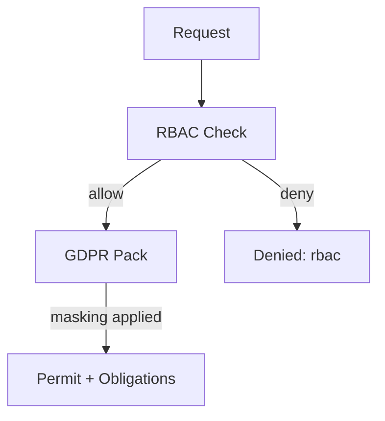

> **Purpose** — Define the **governance model** for SQLx OS: the **Policy Graph (π)** for authorization & compliance, and the **RBAC Matrix** for roles/permissions.  
> π evaluates every action (DDL/DML/DQL/DCL/TCL) in-context (actor, tenant, residency, sensitivity, purpose, time), returns **Permit/Deny** with **Obligations** (masking, routing, approval), and logs an **auditable verdict**.

---

# 1. Model Overview

```mermaid
flowchart LR
    A[Actor / Role] --> Ctx[Execution Context]
    Air[AIR Node & Tags] --> Ctx
    Ctx --> Pi[Policy Graph π]
    Pi -->|Permit/Deny + Obligations| K[Kernel Scheduler]
    Pi --> Led[Audit Ledger]
    Pi <---> Ai[AI Fabric (Explainability/Hints)]
```

**Key Ideas**
- **RBAC → ABAC → PBAC** fusion: roles + attributes + policy packs.  
- **Obligations** enforce runtime changes (e.g., route to read-replica, mask columns).  
- **Deterministic** decisions with **explainable** rationale for audits.

---

# 2. Entities & Vocabulary

| Entity | Description |
|:--|:--|
| **Actor** | User or service identity (`user:alice`, `svc:reporter`) |
| **Role** | Named capability bundle (`analyst`, `dba`, `svc-etl`) |
| **Tenant/Workspace** | Multi-tenant boundary; policy scope |
| **Resource** | Tables, columns, views, datasets (`db.schema.table`) |
| **Action** | `select|insert|update|delete|ddl|grant|revoke|export|backup` |
| **Context** | `{purpose, residency, sensitivity, time, ip, region}` |
| **Obligation** | Mask, redact, route, throttle, require-approval, watermark |
| **Evidence** | Ledger record with signature + rationale graph |

---

# 3. RBAC Matrix (Baseline)

| Role | SELECT | INSERT | UPDATE | DELETE | DDL | EXPORT | ADMIN |
|:--|:--:|:--:|:--:|:--:|:--:|:--:|:--:|
| **viewer** | ✅ | ❌ | ❌ | ❌ | ❌ | ❌ | ❌ |
| **analyst** | ✅ | ❌ | ❌ | ❌ | ❌ | ✅(masked) | ❌ |
| **editor** | ✅ | ✅ | ✅ | ❌ | ❌ | ✅(masked) | ❌ |
| **owner** | ✅ | ✅ | ✅ | ✅ | ✅ | ✅ | ❌ |
| **dba** | ✅ | ✅ | ✅ | ✅ | ✅ | ✅ | ✅ |
| **svc-etl** | ✅(scoped) | ✅ | ✅(scoped) | ❌ | ❌ | ❌ | ❌ |

**Notes**
- RBAC is **necessary but not sufficient** → π enforces attribute conditions and obligations.  
- `scoped` = restricted to specific schemas/tables or time windows.

---

# 4. Attribute Model (ABAC)

Attributes attach to **actor**, **resource**, and **context**.

```yaml
actor:
  id: "svc:billing"
  role: "svc-etl"
  claims: {team: "finance", risk: "low"}

resource:
  fqn: "prod.users"
  tags: {sensitivity: "pii", residency: "eu", retention: "365d"}

context:
  purpose: "etl"
  region: "eu-west-2"
  time: "2025-10-16T14:30:00Z"
  ip: "10.10.10.42"
```

---

# 5. Policy Graph π — Structure

π is a **directed acyclic graph** of **Rules** and **Obligation Nodes**.

```ts
type Decision = "permit" | "deny";
type Obligation = 
  | {type:"mask"; columns:string[]} 
  | {type:"redact"; columns:string[]} 
  | {type:"route"; target:"read-replica"|"region-eu"}
  | {type:"throttle"; qps:number}
  | {type:"approval"; approver:string; ticket?:string}
  | {type:"watermark"; fields:string[]}
  | {type:"audit"; level:"full"|"minimal"};

interface Rule {
  id: string;
  when: Predicate;              // boolean over {actor,resource,context,air}
  effect: Decision;
  obligations?: Obligation[];
  priority?: number;            // higher wins if conflicts
  rationale?: string;           // human-readable
}
```

**Composition**
- Rules grouped into **Policy Packs** (`gdpr`, `hipaa`, `pci`).  
- Packs loaded per workspace/tenant; resolved by **priority + specificity**.

---

# 6. Predicate Language (PiQL)

A minimal, safe, sandboxed expression language.

```ebnf
expr   := orExpr ;
orExpr := andExpr { "OR" andExpr } ;
andExpr:= notExpr { "AND" notExpr } ;
notExpr:= ["NOT"] primary ;
primary:= literal | ident | call | "(" expr ")" ;
call   := ident "(" [args] ")" ;
args   := expr { "," expr } ;
```

**Built-ins (examples)**
- `hasRole("analyst")`
- `tag("sensitivity") == "pii"`
- `purpose() in ["bi","etl"]`
- `region() == "eu-west-2"`
- `action() == "select"`
- `timeBetween("08:00","18:00","Europe/London")`

---

# 7. Evaluation Semantics

1. Gather **RBAC** allow/deny baseline.  
2. Bind **attributes**: `actor`, `resource`, `context`, `air` tags.  
3. Evaluate **Policy Packs** in priority order; first **deny** wins.  
4. Accumulate **obligations** from `permit` rules (no conflict).  
5. Return `{allow, obligations, reason}`; append **ledger** record.

**Pseudocode**
```ts
function evaluate(ctx, air): DecisionResult {
  const rbac = rbacAllow(ctx.actor.role, ctx.action, ctx.resource);
  if (!rbac) return deny("rbac-deny");

  let obligations = [];
  for (const pack of ordered(packs)) {
    for (const rule of pack.rules) {
      if (rule.when(ctx, air)) {
        if (rule.effect === "deny") return deny(rule.rationale || pack.name);
        if (rule.obligations) obligations.push(...rule.obligations);
      }
    }
  }
  return permit(obligations, "rbac-allow+packs");
}
```

---

# 8. Example Policy Packs

## 8.1 GDPR Pack (eu)
```yaml
pack: gdpr
priority: 100
rules:
  - id: gdpr-residency-egress
    when: tag("residency") == "eu" AND region() != "eu-west-2"
    effect: deny
    rationale: "EU data must not egress"
  - id: gdpr-pii-masking
    when: tag("sensitivity") == "pii" AND action() == "select"
    effect: permit
    obligations:
      - {type: mask, columns: ["email","phone","ssn"]}
      - {type: watermark, fields: ["actor","trace_id"]}
```

## 8.2 Finance Export Pack
```yaml
pack: fin-export
priority: 90
rules:
  - id: fin-export-approval
    when: action() == "export" AND purpose() == "bi"
    effect: permit
    obligations:
      - {type: approval, approver: "dpo@nublox"}
      - {type: audit, level: "full"}
```

---

# 9. Column Masking & Row Redaction

**Masking functions** are dialect-aware and applied by UDR at compile time:

| Obligation | MySQL | PostgreSQL |
|:--|:--|:--|
| `mask: email` | `CONCAT(LEFT(email,3),'***',SUBSTRING(email,INSTR(email,'@')))` | `LEFT(email,3)||'***'||SUBSTRING(email FROM POSITION('@' IN email))` |
| `redact: phone` | `REPEAT('*',CHAR_LENGTH(phone))` | `repeat('*',length(phone))` |

Row redaction uses `WHERE` predicates added to the AIR → UDR lowering stage.

---

# 10. Residency & Routing Obligations

Routing obligation example:
```json
{ "type":"route", "target":"region-eu" }
```
Kernel enforces by selecting sessions bound to **EU endpoints**; failing that, **deny** with rationale `route-target-unavailable` unless override token present.

---

# 11. Ledger & Explainability

Each decision writes an **immutable ledger** entry:

```json
{
  "ts": "2025-10-16T15:11:02Z",
  "actor": "svc:billing",
  "action": "select",
  "resource": "prod.users",
  "allow": true,
  "obligations": [{"type":"mask","columns":["email"]}],
  "rationale": "gdpr-pii-masking",
  "trace_id": "4a1b...",
  "sig": "ed25519:abcf..."
}
```

**Explainability Graph**


---

# 12. Observability & Telemetry

Events emitted (ATS schema):
- `policy.evaluate.start|ok|error`
- `policy.deny{reason}`
- `policy.obligation{type}`
- `policy.route.unavailable`
- `policy.approval.requested|granted|rejected`

Metrics:
- `sqlx_policy_denies_total{reason}`  
- `sqlx_policy_eval_ms` histogram  
- `sqlx_policy_obligations_total{type}`

---

# 13. Security Considerations

- Policies are **signed** and versioned; only admins can publish.  
- PiQL is sandboxed (no file/net/clock syscalls) and time-limited.  
- Approval tokens are short-lived, single-use, ledgered.  
- Masking/redaction compiled; **no client-side masking** allowed.  
- Default **deny** on pack load failure or evaluation error.

---

# 14. Testing & Conformance

- **Golden tests** for pack outcomes (fixtures).  
- **Fuzz tests** for PiQL parser.  
- **Mutation tests** to ensure deny-first behavior.  
- **Canary policy** deployment before global rollout.

---

# 15. Open Questions

1. Should we support **Rego** or **Cedar** adapters alongside PiQL?  
2. Cross-pack conflicts — do we add a formal conflict-resolution DSL?  
3. Should obligations be **ordered** (e.g., mask → route → watermark)?  
4. Would a **visual policy editor** in Studio reduce error rate?

---
