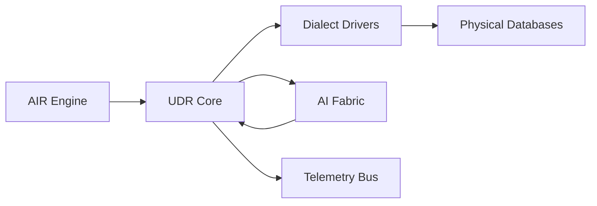
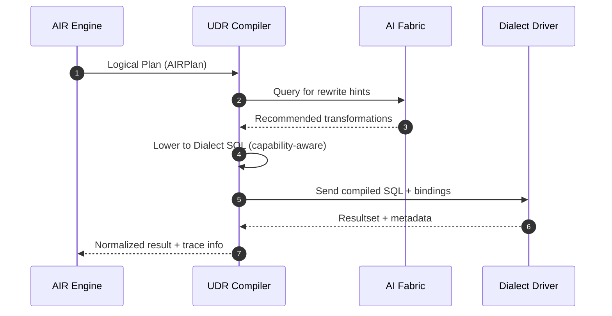

> **Purpose** — The Universal Dialect Runtime (UDR) is the core compiler-runtime bridge that translates AIR plans into dialect-specific SQL for execution and introspection.  
> It forms the executable layer of SQLx OS, providing true **cross-dialect interoperability** with AI-assisted adaptation, schema discovery, and safe bidirectional translation.

---

# 1. Overview

The UDR serves as the **dialect abstraction kernel** within SQLx OS.  
It enables translation between vendor syntaxes, executes dialect-specific features, and feeds the Kernel telemetry loop.

| Layer | Responsibility |
|:--|:--|
| **AIR Engine** | Generates canonical, dialect-agnostic plans |
| **UDR Core** | Compiles plans into dialect SQL using capability profiles |
| **Driver Layer** | Executes compiled SQL and returns structured results |
| **AI Fabric** | Learns dialect idiosyncrasies, recommends rewrites, detects plan regressions |

---

# 2. Architecture



The **UDR Core** exposes three logical subsystems:

1. **Dialect Compiler** — lower AIR → vendor SQL  
2. **Capability Profiler** — discover & persist dialect feature maps  
3. **Runtime Executor** — manage statement execution, parameter binding, and result normalization

---

# 3. Dialect Capability Model (AIRCaps)

```ts
export interface DialectCaps {
  dialect: "mysql"|"postgres"|"sqlite"|"oracle"|"mssql"|"custom";
  version: string;
  supports: string[];           // features (e.g., "CTE","WINDOW","JSON","UPSERT")
  limits: Record<string,number>; // e.g., max_params, max_index_cols
  keywords: string[];
  functions: Record<string,string[]>; // canonical->dialect function map
  quirks?: Record<string,string>;
}
```

The UDR initializes capability profiles via:
- **Active Discovery** — execute dialect introspection queries  
- **Static Profiles** — YAML/JSON descriptors shipped with drivers  
- **AI Completion** — infer missing capabilities from behavior and errors  

---

# 4. Compilation Pipeline



---

# 5. Translation Stages

| Stage | Description |
|:--|:--|
| **Stage 1 — Syntax Rewrite** | Replace canonical AIR tokens with dialect keywords (e.g., LIMIT → TOP) |
| **Stage 2 — Capability Check** | Skip or emulate unsupported constructs |
| **Stage 3 — Type & Function Mapping** | Convert types (BOOLEAN→TINYINT) and functions (`CONCAT_WS`→`||`) |
| **Stage 4 — Quoting & Escaping** | Normalize identifiers and literals |
| **Stage 5 — Execution Routing** | Send SQL to correct driver with correct protocol |
| **Stage 6 — Telemetry & Hashing** | Hash final SQL for plan caching and observability |

---

# 6. Bidirectional Translation (Reverse Compilation)

The reverse path (`dialect SQL → AIR`) allows AI introspection, schema migration, and dialect learning.

```ts
export interface ReverseCompiler {
  parse(sql: string, dialect: string): AIRNode;
  explain(air: AIRNode): string;
}
```

This ensures **lossless reversibility** for all supported dialects.

---

# 7. Emulation & Safe Downgrades

When a dialect lacks a feature, the UDR attempts emulation:

| Feature | Missing Dialect | Emulation Strategy |
|:--|:--|:--|
| `UPSERT` | MySQL < 5.7 | `INSERT ... ON DUPLICATE KEY UPDATE` |
| `WINDOW FUNCTIONS` | SQLite | Materialized subquery fallback |
| `JSON_EXTRACT` | MSSQL | XML PATH emulation |
| `ARRAY_AGG` | MySQL < 8.0 | GROUP_CONCAT surrogate |

Each emulation is tagged `safety: low|medium|high` and logged to TKB for audit.

---

# 8. Execution Interface

```ts
export interface UdrBridge {
  lower(plan: AIRPlan, caps: DialectCaps): Promise<DialectSql>;
  route(dsql: DialectSql, session: Session): Promise<DriverResult>;
  reverse(sql: string, dialect: string): Promise<AIRNode>;
}

export interface DialectSql {
  text: string;
  params?: any[];
  metadata?: Record<string,unknown>;
}
```

**DriverResult Example**
```json
{
  "rows": 42,
  "fields": ["id","name"],
  "plan_hash": "ph:ab12",
  "latency_ms": 17,
  "trace_id": "tid-991",
  "retries": 0
}
```

---

# 9. AI-Assisted Optimization

The AI Fabric contributes to UDR performance via:
- **Plan Embedding Similarity** — find similar queries and suggest rewrites  
- **Error Clustering** — learn failure patterns for dialect-specific quirks  
- **Capability Prediction** — auto-discover features from telemetry  
- **Rewrite Synthesis** — generate equivalent SQL fragments when errors occur  

---

# 10. Observability Integration

Every compiled and executed SQL statement emits structured telemetry:

| Event | Description |
|:--|:--|
| `udr.compile.start|ok|error` | AIR→SQL lowering |
| `udr.reverse.start|ok|error` | SQL→AIR reverse |
| `udr.emulation.used` | Emulated construct executed |
| `udr.exec.start|ok|error` | Driver execution |
| `udr.retry` | Automatic retry triggered |

Telemetry is emitted on the **Telemetry Kernel Bus (TKB)** and traced through OpenTelemetry spans.

---

# 11. Error Classes

| Code | Category | Description | Recovery |
|:--|:--|:--|:--|
| UDR-E001 | Capability Missing | Feature unsupported | Emulate or downgrade |
| UDR-E002 | Translation Error | Invalid mapping | Re-parse AIR node |
| UDR-E003 | Reverse Parse Error | Dialect AST error | Skip telemetry |
| UDR-E004 | Driver Timeout | Engine stall | Cancel + retry |
| UDR-E005 | Plan Hash Mismatch | Non-deterministic output | Regenerate AIR |

---

# 12. Performance & Benchmarks

| Metric | Target | Notes |
|:--|:--|:--|
| Compile latency (p95) | < 5 ms | AIR→SQL |
| Reverse latency (p95) | < 10 ms | SQL→AIR |
| Capability discovery | < 500 ms | One-time |
| Telemetry overhead | < 3 % | per exec |
| Deterministic hash stability | 100 % | across runs |

---

# 13. Security & Compliance

- UDR must **sanitize** all identifiers and literals before driver execution.  
- No direct string concatenation; parameter binding mandatory.  
- AI rewrite suggestions are **non-executing** until approved by Kernel policy.  
- All generated SQL statements are logged with `plan_hash` and `trace_id`.  
- Reverse compilation redacts sensitive literals (e.g., passwords, tokens).  

---

# 14. Example Translation

**AIR**
```json
{
  "root": "air:stmt:Q-9f3a",
  "nodes": [
    {"id":"air:stmt:Q-9f3a","type":"statement","kind":"SELECT"},
    {"id":"air:expr:C1","type":"expr","kind":"COLUMN","value":"name"},
    {"id":"air:expr:C2","type":"expr","kind":"COLUMN","value":"age"},
    {"id":"air:clause:WHERE1","type":"clause","kind":"WHERE","children":["air:expr:P1"]},
    {"id":"air:expr:P1","type":"expr","kind":"GT","children":["air:expr:C2",{"type":"literal","value":30}]}
  ]
}
```

**UDR Output (MySQL)**  
```sql
SELECT name, age FROM users WHERE age > 30;
```

**UDR Output (SQL Server)**  
```sql
SELECT name, age FROM users WHERE age > 30;
```

✅ *Lossless, deterministic translation across dialects.*

---

# 15. Open Questions

1. Should UDR maintain an LRU cache for compiled SQL per dialect?  
2. Can UDR dynamically learn grammar deltas from query failures?  
3. Should emulation packs be externalized and versioned as plugins?  
4. Can AI agents validate semantic equivalence via plan comparison?  

---
