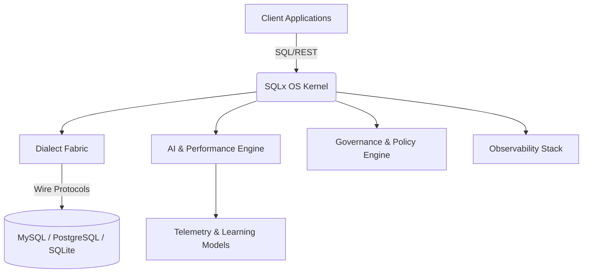

# Abstract

Modern enterprises operate polyglot relational environments; manual tuning, dialect fragmentation, and reactive governance impose unsustainable overhead.  
We propose **NuBlox SQLx OS**, a next-generation **Database Operating System (DBOS)** — AI-augmented, dialect-agnostic, and self-learning across the full spectrum of relational control: connection management, DDL/DML/DQL/DCL/TCL handling, optimization, security, compliance, observability, and orchestration.  
SQLx OS fuses wire-protocol introspection, a canonical abstract SQL representation, and reinforcement-style learning agents into a unified control plane.

**Keywords:** Autonomous Database, AI-Driven RDBMS, Dialect Translation, Reinforcement Learning, Data Governance, Observability, Compliance.

---

# 1 Introduction

Relational databases underpin global information systems yet remain static and siloed.  
Developers manually tune indices, migrate schemas, and reconcile dialect differences across MySQL, PostgreSQL, Oracle, and SQLite.  
This paper introduces **NuBlox SQLx OS**, an *AI-powered, dialect-agnostic database operating system* that transforms traditional RDBMSs into adaptive, self-optimizing, and policy-aware ecosystems.

SQLx OS unifies:
- **Dialect-agnostic interpretation** via an Abstract Intermediate Representation (AIR);
- **AI-driven optimization** that learns from telemetry;
- **Control-plane intelligence** managing clients, servers, and schema life cycles;
- **Security and compliance governance** integrated by design.

---

# 2 Related Work

Autonomous and AI-augmented database research provides the foundation for SQLx OS:

- **NeurDB** \cite{zhao2024neurdb}: AI-powered autonomous database integrating adaptive workload learning.  
- **Cognitive Databases** \cite{bordawekar2017cognitive}: semantic enrichment of relational queries using vector embeddings.  
- **KnobTree** \cite{knobtree2024}: interpretable reinforcement learning for parameter tuning.  
- **MILEPOST GCC** \cite{milepost2009}: self-tuning compiler inspiring adaptive optimization frameworks.

These systems improve localized components (optimizers, indexers) but not the *entire* RDBMS control surface. SQLx OS aims to unify them under a single intelligent runtime.

---

# 3 System Architecture

$$
\text{SQLx OS} = \{ K, D, A, G, O \}
$$

where  
$K$ = Kernel,  
$D$ = Driver Fabric,  
$A$ = AI Engine,  
$G$ = Governance,  
$O$ = Observability.



**Figure 1:** High-level SQLx OS architecture.

---

# 4 Dialect-Agnostic Intermediate Representation (AIR)

Every statement passes through AIR — a dialect-neutral abstract syntax graph $G(V,E)$ capturing logical intent, dependencies, and constraints.

Properties:
1. **Lossless translation:** $ f_{\text{dialect}}^{-1}(f_{\text{dialect}}(AIR)) = AIR $
2. **Semantic equivalence:** queries maintain identical relational semantics across dialects.
3. **Adaptive learning:** the system infers dialect grammars via active probing and federated updates.

---

# 5 Connection and Server Orchestration

## 5.1 Adaptive Connection Fabric
- Learned session reuse prediction $ P(r|u,t) $
- Latency-aware routing: minimize $ \mathbb{E}[L_{conn}] $
- Credential lifecycle automation: ephemeral key rotation and sandboxing

## 5.2 Server Lifecycle
- Auto-provisioning, replication topology inference
- Failure prediction using anomaly detection over $ \{CPU, I/O, QPS\} $
- Self-healing restarts and live migration


# 5.3 Deployment Topology and Environment Awareness (Visuals)

Below visuals illustrate how SQLx OS discovers and orchestrates **local**, **remote**, **containerized**, and **cloud-managed** databases through the control plane.

## Adaptive Deployment Fabric (Mermaid)
```mermaid
flowchart LR
    %% Clients & Control Plane
    A[Client Apps / Services] -->|SQL / REST / GraphQL| CP[SQLx OS Control Plane]
    subgraph CPX[SQLx OS Control Plane]
      CP -- Telemetry --> OBS[Observability & Metrics]
      CP -- Policies --> GOV[Governance & Compliance]
      CP -- Models --> AI[AI & Optimization Engine]
      CP -- Adapters --> ADP[Environment Adapters]
    end

    %% Environment Adapters
    subgraph ADPX[Environment Adapters]
      LCL[Local/Edge Adapter]
      REM[Remote Server Adapter]
      CNT[Container Orchestrator Adapter]
      CLD[Cloud Provider Adapter]
    end

    %% Targets
    subgraph LCLX[Local / Edge]
      L1[(SQLite / MySQL Local)]
      L2[(Embedded RDBMS)]
    end

    subgraph REMX[Remote Servers]
      R1[(MySQL Cluster)]
      R2[(PostgreSQL Primary/Replica)]
    end

    subgraph CNTX[Containerized (Docker/K8s)]
      K1[(StatefulSet: pg)]
      K2[(Deployment: mysql)]
    end

    subgraph CLDX[Managed Cloud]
      C1[(AWS RDS / Aurora)]
      C2[(GCP Cloud SQL / AlloyDB)]
      C3[(Azure Database)]
    end

    %% Wiring
    ADP --> LCL
    ADP --> REM
    ADP --> CNT
    ADP --> CLD

    LCL --> L1 & L2
    REM --> R1 & R2
    CNT --> K1 & K2
    CLD --> C1 & C2 & C3

    %% Feedback loops
    OBS -- Anomalies/Drift --> AI
    AI -- Recommendations --> GOV
    GOV -- Enforce/Approve --> CP

    %% Actions
    CP -. Provision/Clone/Failover .-> R1
    CP -. Rollout/Scale .-> K1
    CP -. Region-aware Routing .-> C1
    CP -. Offline Sync .-> L1
```

## Provisioning + Failover Sequence (Mermaid)
```mermaid
sequenceDiagram
    autonumber
    participant App as Client App
    participant CP as SQLx Control Plane
    participant AI as AI/Optimization
    participant GOV as Governance/Policy
    participant CNT as K8s Adapter
    participant CLD as Cloud Adapter
    participant DBp as Primary DB
    participant DBr as Replica DB

    App->>CP: Connect + Query Intent
    CP->>AI: Provide workload profile + SLOs
    AI-->>CP: Placement plan (region, engine, size)
    CP->>GOV: Request policy check (region/PII)
    GOV-->>CP: Approved (constraints/tags)
    CP->>CLD: Provision managed DB (primary + replica)
    CLD-->>CP: Endpoints + creds
    CP->>CNT: Deploy sidecars/agents (if containerized)
    CNT-->>CP: Health probes registered
    CP->>DBp: Bootstrap schema (AIR->Dialect)
    CP-->>App: Return connection info (pooled)
    Note over CP,DBp: Live traffic <br/> Telemetry streaming

    %% Failure branch
    DBp-->>CP: Health degrade alert
    CP->>AI: Evaluate failover options
    AI-->>CP: Promote replica; adjust routing
    CP->>GOV: Seek approval (if required)
    GOV-->>CP: Approved
    CP->>DBr: Promote to Primary
    CP->>CLD: Spin up new Replica
    CP-->>App: Seamless reconnect/route update
```

## (Optional) TikZ/LaTeX Figure Stub
```latex
\begin{figure}[t]
\centering
\begin{tikzpicture}[>=latex,node distance=10mm, every node/.style={font=\small}]
\node[draw,rounded corners,fill=gray!10,inner sep=6pt] (cp) {SQLx OS Control Plane};
\node[draw,rounded corners,fill=blue!7,below left=12mm and 20mm of cp] (local) {Local/Edge};
\node[draw,rounded corners,fill=blue!7,below=12mm of cp] (remote) {Remote Servers};
\node[draw,rounded corners,fill=blue!7,below right=12mm and 20mm of cp] (k8s) {Containers (K8s)};
\node[draw,rounded corners,fill=blue!7,right=30mm of cp] (cloud) {Managed Cloud};

\draw[->] (cp) -- node[midway,above left]{Adapter} (local);
\draw[->] (cp) -- node[midway,left]{Adapter} (remote);
\draw[->] (cp) -- node[midway,above right]{Adapter} (k8s);
\draw[->] (cp) -- node[midway,above]{Adapter} (cloud);

\node[below=6mm of local] (l1) {(SQLite/MySQL Local)};
\node[below=6mm of remote] (r1) {(MySQL Cluster / PG)};
\node[below=6mm of k8s] (k1) {(StatefulSets)};
\node[below=6mm of cloud] (c1) {(RDS/Cloud SQL/Azure)};

\draw[<-,thick] (cp) ++(0,8mm) -- ++(0,8mm) node[above]{Clients (SQL/REST/GraphQL)};
\draw[->,bend left=10] (local) to node[midway,sloped,above]{Telemetry} (cp);
\draw[->,bend left=10] (remote) to node[midway,sloped,above]{Telemetry} (cp);
\draw[->,bend left=10] (k8s) to node[midway,sloped,above]{Telemetry} (cp);
\draw[->,bend left=10] (cloud) to node[midway,sloped,above]{Telemetry} (cp);

\node[draw,rounded corners,fill=green!8,above right=5mm and -5mm of cp] (ai) {AI/Optimization};
\node[draw,rounded corners,fill=orange!10,below right=5mm and -5mm of cp] (gov) {Governance/Policy};
\draw[<->] (cp) -- (ai);
\draw[<->] (cp) -- (gov);
\end{tikzpicture}
\caption{Adaptive Deployment Fabric across local, remote, container, and cloud targets with AI and governance in the loop.}
\end{figure}
```

---

# 6 Autonomous SQL Domain Management

| Domain | Learning Signal | Autonomous Behavior |
|:--|:--|:--|
| DDL | Schema diff deltas | AI-planned migrations, constraint inference |
| DML | CRUD patterns | Conflict-aware batching, deadlock learning |
| DQL | Cost models, plan trees | Regression detection, adaptive caching |
| DCL | Access logs | Least-privilege enforcement, anomaly flagging |
| TCL | Transaction telemetry | Isolation-level tuning, auto-retry logic |

Each execution produces a learning artifact:

$$
\mathcal{A} = \{ AIR, \text{plan}, \text{stats}, \text{latency}, \text{outcome} \}
$$

which feeds the reinforcement optimizer.

---

# 7 AI-Powered Performance Engine

- **Telemetry ingestion:** query traces, plan graphs, locks, and metrics.  
- **Feature extraction:** vectorization of workload features.  
- **Reinforcement Optimizer:** reward $R = -(\text{latency} + \alpha\cdot\text{cost})$.  
- **Plan regression detector:** compares new plan $P'$ to baseline $P$ using $ \Delta_{\text{cost}} > \tau \Rightarrow \text{rollback} $.

Agents propose index, partition, and caching strategies with explainable rationales stored in policy graphs.

---

# 8 Security and Compliance Intelligence

## 8.1 Policy Engine
- Behavioral modeling to detect privilege anomalies  
- Just-in-time privilege elevation  
- Zero-trust isolation domains

## 8.2 Encryption and Key Rotation
All network sessions negotiate TLS; storage encryption uses AES-GCM with automatic key rotation.

## 8.3 Compliance Graph
Let $ G_c = (N, E) $ where each node $ n_i $ represents a schema element annotated with compliance tags (GDPR, HIPAA).  
Edges denote data lineage; traversals detect policy violations before deployment.

---

# 9 Observability and Self-Healing

Telemetry normalized via OpenTelemetry schema; anomalies trigger policies $ \pi : \text{state} \rightarrow \text{action} $.

Examples:
- Detect query latency drift $ \Delta L > 3\sigma $ → rebalance cache.  
- Detect schema checksum mismatch → auto-rollback migration.  

---

# 10 Developer Integration

- **CLI / SDK / GraphQL API:** unified control surface.  
- **Studio Interface:** visual layer for performance tuning and compliance review.  
- **Plugin System:** third-party AI models, dialect adapters, and observability sinks.  
- **Federated Learning:** optional sharing of anonymized dialect and performance models.

---

# 11 Challenges and Research Directions

1. **Cold-start problem** — bootstrapping cost models with limited data.  
2. **Explainability vs. autonomy** — human oversight in AI actions.  
3. **Safety bounds** — rollback guarantees for auto-migrations.  
4. **Scalability** — distributed inference across clusters.  

---

# 12 Future Work

- Neural-symbolic query compilers combining LLM reasoning with relational algebra.  
- Quantum or combinatorial search for plan optimization.  
- Graph-relational fusion for unified reasoning.  
- Digital-twin sandbox clusters for what-if experimentation.  

---

# 13 Conclusion

NuBlox SQLx OS represents a paradigm shift: a self-learning, self-healing, and dialect-agnostic database operating system.  
It unites query intelligence, compliance governance, and operational orchestration into a single AI-powered control plane — the foundation for truly autonomous data infrastructure.

---

# References
\begin{thebibliography}{00}
\bibitem{zhao2024neurdb} Zhao et al., “NeurDB: An AI-Powered Autonomous Database,” *arXiv preprint*, 2024.  
\bibitem{bordawekar2017cognitive} Bordawekar et al., “Cognitive Databases,” *IBM Research Report*, 2017.  
\bibitem{knobtree2024} Lin et al., “KnobTree: Interpretable Reinforcement Learning for DB Tuning,” *arXiv preprint*, 2024.  
\bibitem{milepost2009} Fursin et al., “MILEPOST GCC: Machine Learning Enabled Self-tuning Compiler,” *International Journal of Parallel Programming*, 2009.  
\end{thebibliography}
