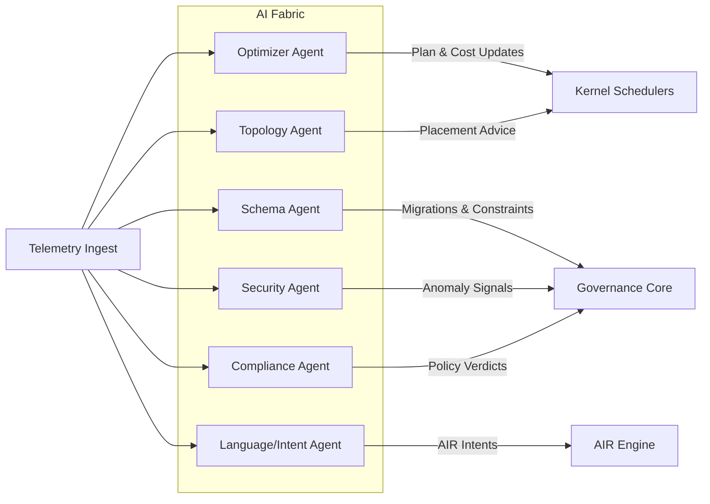
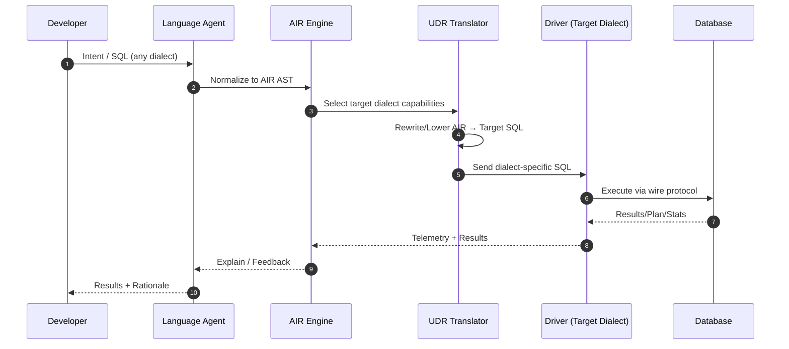
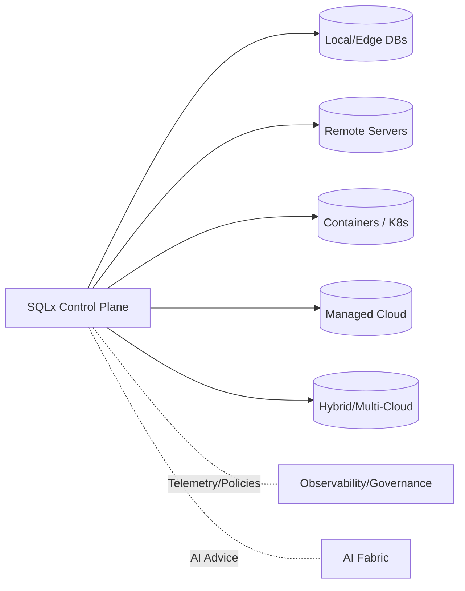
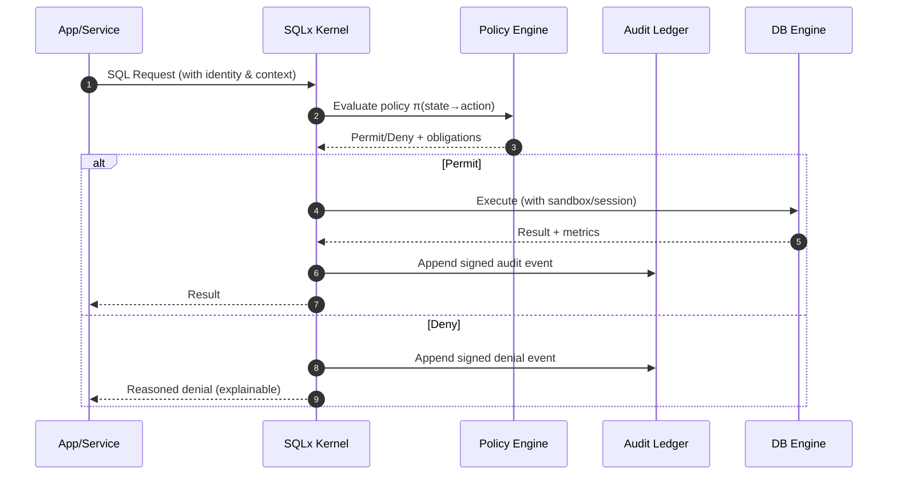
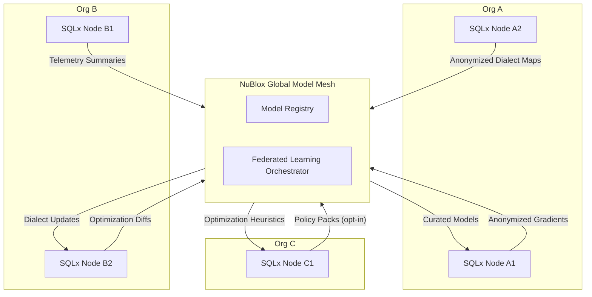

# Executive Summary

NuBlox SQLx OS v4.0 defines a new computing class: the **Database Operating System (DBOS)** — an AI-powered, dialect-agnostic control plane that unifies relational intelligence, observability, compliance, and orchestration across local, remote, containerized, and cloud data environments.  
It transforms static database engines into **autonomous, self-learning ecosystems** that can reason about queries, performance, security, and topology in real time.

---

# 1  Vision

To build **the intelligent operating system for data**, where every database — from embedded edge nodes to cloud clusters — participates in a self-optimizing, policy-aware mesh.  
SQLx OS will:

- Abstract dialects into a universal intermediate language (AIR)  
- Learn autonomously from workload telemetry  
- Govern security, compliance, and observability as first-class citizens  
- Scale across heterogeneous environments without friction  
- Provide an extensible AI kernel and SDK fabric for continuous evolution  

> *“The Database that thinks, governs, and heals itself.”*

---

# 2  Strategic Objectives

| Objective | Outcome |
|:--|:--|
| **Unify Dialects** | Single semantic layer across MySQL, PostgreSQL, SQLite, Oracle, MSSQL |
| **Embed Intelligence** | Reinforcement & supervised models for plan optimization and anomaly detection |
| **Operational Autonomy** | Self-healing connections, schema evolution, adaptive caching |
| **Compliance by Design** | Continuous policy validation and auditable lineage graph |
| **Federated Learning Mesh** | Global exchange of anonymized optimization and dialect models |
| **Studio Experience** | The most advanced AI-assisted IDE for data design and governance |

---

# 3  Technical Architecture Overview

```
+-------------------------------------------------------------+
|                 NuBlox SQLx OS Kernel                       |
|  • Connection / Session Fabric                              |
|  • Dialect Translator (AIR Engine)                          |
|  • AI Telemetry Bus (Learning + Reward Loop)                |
|  • Security / Policy Runtime                                |
|  • Observability + Event Bus                                |
+-------------------------------------------------------------+
     |        |         |         |
     v        v         v         v
  Driver Fabric  AI Engine  Governance Core  Observability Stack
     |                      |
     +---> Multi-Dialect RDBMS Engines & Environments (local → cloud)
```

**Key Concept:** The **SQLx Kernel** behaves like an OS scheduler — allocating transactions, telemetry, and policy execution just as Linux schedules threads.

## 3.1 Kernel Modules Overview (Mermaid)
```mermaid
flowchart TB
    subgraph Kernel["SQLx OS Kernel"]
      KF[Connection / Session Fabric]
      AIR[Dialect Translator (AIR Engine)]
      TBus[AI Telemetry Bus]
      SEC[Security / Policy Runtime]
      OBS[Observability & Event Bus]
      SCH[Transaction Scheduler]
    end

    KF --> AIR
    AIR --> TBus
    TBus --> SEC
    TBus --> OBS
    SEC --> SCH
    SCH --> KF

    %% Edges to subsystems
    Kernel --> DRV[Driver Fabric]
    Kernel --> AIF[AI Fabric]
    Kernel --> GOV[Governance Core]
    Kernel --> OSTK[Observability Stack]
```

### (Optional) TikZ Stub — Kernel Overview
```latex
\begin{tikzpicture}[node distance=10mm,>=latex,every node/.style={font=\small}]
\node[draw,rounded corners,fill=gray!10] (krn) {SQLx OS Kernel};
\node[draw,rounded corners,below left=of krn] (kf) {Conn/Session Fabric};
\node[draw,rounded corners,below=of krn] (air) {AIR Engine};
\node[draw,rounded corners,below right=of krn] (tbus) {AI Telemetry Bus};
\node[draw,rounded corners,right=25mm of krn] (sec) {Security/Policy};
\node[draw,rounded corners,below=of sec] (obs) {Observability};
\node[draw,rounded corners,below=of kf] (sch) {Txn Scheduler};
\draw[->] (kf) -- (air);
\draw[->] (air) -- (tbus);
\draw[->] (tbus) -- (sec);
\draw[->] (tbus) -- (obs);
\draw[->] (sec) -- (sch);
\draw[->] (sch) -- (kf);
\end{tikzpicture}
```

---

# 4  AI Kernel Specification (AIF — AI Fabric)

The AI Fabric consists of modular agents:

| Agent | Role |
|:--|:--|
| **Optimizer Agent** | Reinforcement learner adjusting cost models and query plans |
| **Schema Agent** | Learns evolution patterns, predicts migration safety |
| **Security Agent** | Models user/role behaviour, flags anomalies |
| **Compliance Agent** | Evaluates policy graph against live data structures |
| **Topology Agent** | Predicts optimal placement across local, container, and cloud |
| **Language Agent** | Translates natural language intent ↔ SQL AIR representation |

Each agent interacts via the **Telemetry Bus**, exchanging features and rewards under strict policy boundaries.

## 4.1 AI Fabric & Telemetry Loop (Mermaid)


### Telemetry → Learning → Optimization Loop
```mermaid
flowchart LR
    QRY[Queries & Plans] --> FEAT[Feature Extraction]
    FEAT --> MOD[Model Update (RL+SL)]
    MOD --> REW[Reward/Eval Signals]
    REW --> POL[Policy Graph Check]
    POL --> ACT[Optimizer Actions]
    ACT --> QRY
    FEAT --> OBS[Observability Store]
    ACT --> EXP[Explainability Graphs]
```

### (Optional) TikZ Stub — AI Fabric
```latex
\begin{tikzpicture}[node distance=10mm,>=latex,every node/.style={font=\small}]
\node[draw,rounded corners] (tin) {Telemetry Ingest};
\node[draw,rounded corners,below=of tin] (opt) {Optimizer Agent};
\node[draw,rounded corners,right=12mm of opt] (sca) {Schema Agent};
\node[draw,rounded corners,below=of opt] (sec) {Security Agent};
\node[draw,rounded corners,right=12mm of sec] (coa) {Compliance Agent};
\node[draw,rounded corners,below=of sec] (top) {Topology Agent};
\node[draw,rounded corners,right=12mm of top] (lga) {Language Agent};
\node[draw,rounded corners,fill=gray!10,above=18mm of tin] (krn) {Kernel/Schedulers};
\node[draw,rounded corners,fill=gray!10,right=18mm of krn] (gov) {Governance Core};
\node[draw,rounded corners,fill=gray!10,right=18mm of gov] (air) {AIR Engine};
\draw[->] (tin) -- (opt);
\draw[->] (tin) -- (sca);
\draw[->] (tin) -- (sec);
\draw[->] (tin) -- (coa);
\draw[->] (tin) -- (top);
\draw[->] (tin) -- (lga);
\draw[<->] (opt) -- (krn);
\draw[<->] (top) -- (krn);
\draw[<->] (sca) -- (gov);
\draw[<->] (sec) -- (gov);
\draw[<->] (coa) -- (gov);
\draw[<->] (lga) -- (air);
\end{tikzpicture}
```

---

# 5  Universal Dialect Runtime (UDR)

A dynamic compilation framework translating SQL dialects in both directions at runtime.  
Capabilities:

- **Abstract Intermediate Representation (AIR)** — canonical AST graph  
- **Lossless Translation** between vendor syntaxes  
- **Dialect Discovery AI** learns grammar and capability sets automatically  
- **Live Migration Mode** — re-target running workloads between engines without downtime  

## 5.1 UDR Transform Path (Mermaid)


### (Optional) TikZ Stub — UDR Path
```latex
\begin{tikzpicture}[node distance=10mm,>=latex,every node/.style={font=\small}]
\node[draw,rounded corners] (dev) {Developer};
\node[draw,rounded corners,right=of dev] (lga) {Language Agent};
\node[draw,rounded corners,right=of lga] (air) {AIR Engine};
\node[draw,rounded corners,right=of air] (udr) {UDR Translator};
\node[draw,rounded corners,right=of udr] (drv) {Driver};
\node[draw,rounded corners,right=of drv] (db) {Database};
\draw[->] (dev) -- (lga);
\draw[->] (lga) -- (air);
\draw[->] (air) -- (udr);
\draw[->] (udr) -- (drv);
\draw[->] (drv) -- (db);
\draw[<-] (drv) -- ++(0,-10mm) -| (air);
\end{tikzpicture}
```

---

# 6  Adaptive Deployment Fabric

SQLx OS orchestrates data environments regardless of physical location.

| Environment | Discovery & Control |
|:--|:--|
| **Local / Edge** | File introspection, offline caching, sync reconciliation |
| **Remote Servers** | TLS handshake introspection, latency-aware routing |
| **Containerized (K8s/Docker)** | API integration with orchestrators, health probes, ephemeral scaling |
| **Managed Cloud** | Provision via RDS/Azure/GCP APIs, credentials and cost governance |
| **Hybrid Multi-Cloud** | Policy-aware workload placement and replication planning |

## 6.1 Deployment Fabric Recap (Mermaid)


## 6.2 Transaction Scheduler Analogy (Mermaid)
```mermaid
flowchart LR
    Q[Incoming Transactions] --> CLS[Classify (latency/priority)]
    CLS --> QH[Queue Heads]
    QH -->|Preemptive| DISP[Dispatcher]
    DISP --> IOQ[I/O Queue]
    IOQ --> ENG[Engine Threads]
    ENG --> MET[Runtime Metrics]
    MET --> FB[Scheduler Feedback]
    FB --> CLS
```

### (Optional) TikZ Stub — Deployment Fabric
```latex
\begin{tikzpicture}[node distance=10mm,>=latex,every node/.style={font=\small}]
\node[draw,rounded corners,fill=gray!10] (cp) {SQLx Control Plane};
\node[draw,rounded corners,below left=of cp] (lcl) {Local/Edge};
\node[draw,rounded corners,below=of cp] (rem) {Remote};
\node[draw,rounded corners,below right=of cp] (cnt) {Containers};
\node[draw,rounded corners,right=25mm of cp] (cld) {Managed Cloud};
\draw[->] (cp) -- (lcl);
\draw[->] (cp) -- (rem);
\draw[->] (cp) -- (cnt);
\draw[->] (cp) -- (cld);
\end{tikzpicture}
```

---

# 7  Telemetry and Learning Pipeline

1. **Collect:** Queries, plans, latencies, locks, metrics  
2. **Transform:** Feature vectorization + normalization  
3. **Evaluate:** Reinforcement signal generation  
4. **Optimize:** Update cost models, rewrite rules, cache heuristics  
5. **Explain:** Produce human-readable rationale graphs  

---

# 8  Security and Governance Fabric

- **Zero-Trust Runtime:** every action evaluated through policy graph π(state → action).  
- **Immutable Audit Ledger:** cryptographically signed DDL/DML/DCL/TCL events.  
- **Live Compliance Validation:** detect GDPR/HIPAA/ISO violations before execution.  
- **Homomorphic Encryption Bridge:** allow computation on encrypted data when supported.  
- **Data Residency Enforcer:** region-specific tagging and automatic routing.

## 8.1 Policy Enforcement Flow (Mermaid)


---

# 9  Developer and Studio Experience

NuBlox Studio v2 introduces:

- **AIR / SQL dual-pane editor** with real-time plan feedback  
- **Explainable AI Panel** describing optimizer decisions  
- **Compliance Bar** rating queries on privacy + security risk  
- **Multi-Dialect Simulator** running queries across engines simultaneously  
- **Declarative Schema Sketching** — AI converts visuals to live DDL & migrations  

---

# 10  Ecosystem and Federation

The **SQLx Mesh** connects enterprises through secure model sharing.

| Component | Description |
|:--|:--|
| **Federated Learning Network** | Nodes share gradients, not data |
| **Model Exchange Registry** | Repository of learned dialects and optimizers |
| **Compliance Mesh** | Distributed policy synchronization |
| **Optimization Marketplace** | Community-driven performance packs and heuristics |

## 10.1 Federated Mesh Topology (Mermaid)


### (Optional) TikZ Stub — Federated Mesh
```latex
\begin{tikzpicture}[node distance=10mm,>=latex,every node/.style={font=\small}]
\node[draw,rounded corners] (a1) {Org A: Node A1};
\node[draw,rounded corners,below=of a1] (a2) {Org A: Node A2};
\node[draw,rounded corners,right=25mm of a1] (b1) {Org B: Node B1};
\node[draw,rounded corners,below=of b1] (b2) {Org B: Node B2};
\node[draw,rounded corners,right=25mm of b1] (c1) {Org C: Node C1};
\node[draw,rounded corners,fill=gray!10,above=15mm of b1] (mesh) {Global Model Mesh};
\node[draw,rounded corners,above=5mm of mesh] (reg) {Model Registry};
\node[draw,rounded corners,right=8mm of mesh] (fl) {FL Orchestrator};
\draw[->] (a1) -- (mesh);
\draw[->] (a2) -- (mesh);
\draw[->] (b1) -- (mesh);
\draw[->] (b2) -- (mesh);
\draw[->] (c1) -- (mesh);
\draw[->] (mesh) -- (a1);
\draw[->] (mesh) -- (b2);
\draw[->] (mesh) -- (c1);
\end{tikzpicture}
```

---

# 11  Commercial and Licensing Model

| Edition | Features | Target |
|:--|:--|:--|
| **SQLx Core (OSS)** | Kernel, drivers, CLI | Developers & academia |
| **SQLx Pro** | Studio IDE, local AI agents | Professional teams |
| **SQLx Enterprise / Mesh** | Federated AI, compliance, observability | Regulated enterprises |
| **SQLx Edge** | Embedded runtime for IoT / defense | OEMs and field systems |

Licensing follows a **“Compute + Governance Credit”** model — predictable, transparent, and enterprise-ready.

---

# 12  Roadmap to v4.0 Launch (2025 → 2026)

| Phase | Timeline | Focus |
|:--|:--|:--|
| **Alpha 4.0** | Q4 2025 | AI Kernel Prototype + Driver Fabric Refactor |
| **Beta 4.0** | Q1 2026 | Studio v2 Launch + Governance Fabric |
| **Release Candidate** | Q2 2026 | Federated Telemetry + Enterprise Security |
| **GA v4.0** | Q3 2026 | Public Mesh Network + Compliance Marketplace |

> *Milestone Goal:* establish SQLx OS as the reference architecture for AI-powered relational infrastructure.

---

# Closing Statement

NuBlox SQLx OS v4.0 redefines how humanity interacts with data.  
It is not a database, not an ORM, and not an IDE — it is **an operating system for relational intelligence**, capable of self-learning, self-governing, and self-healing.  

Once released, it will represent the **foundational control fabric of the next generation of intelligent infrastructure.**
