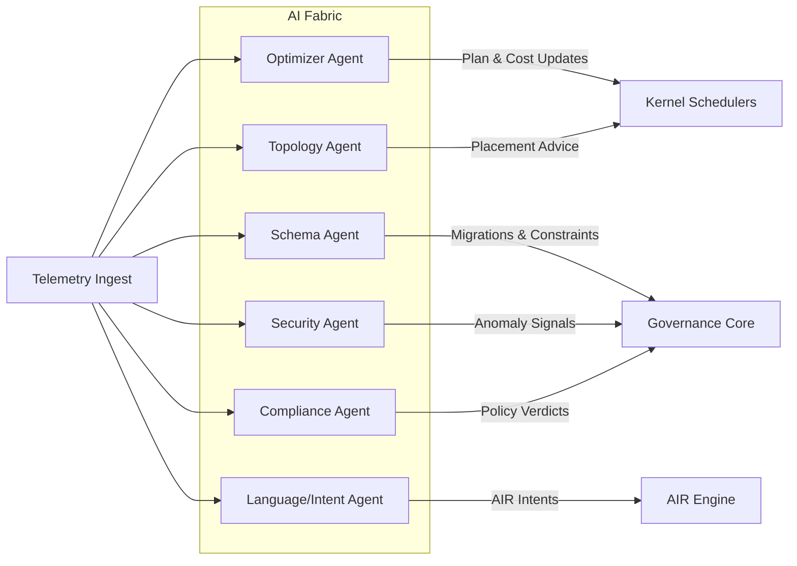
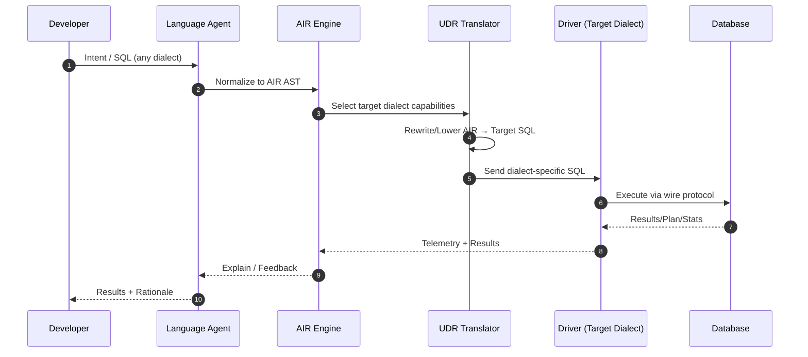
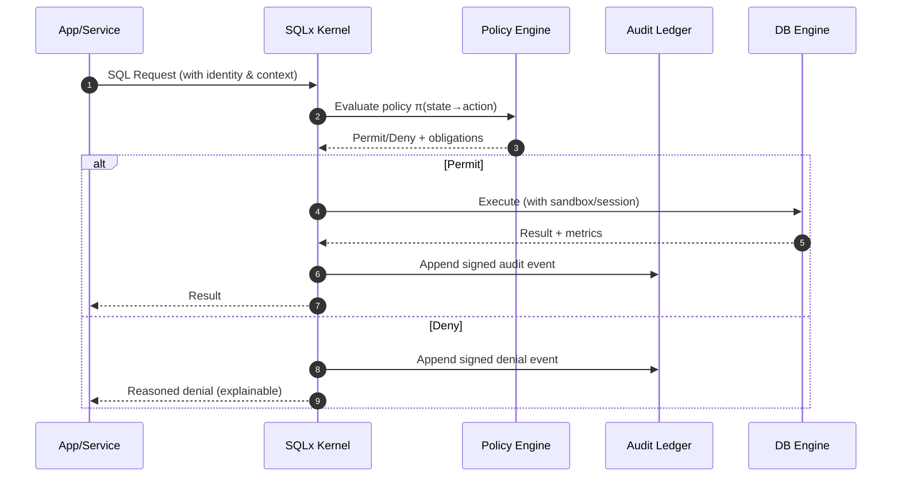
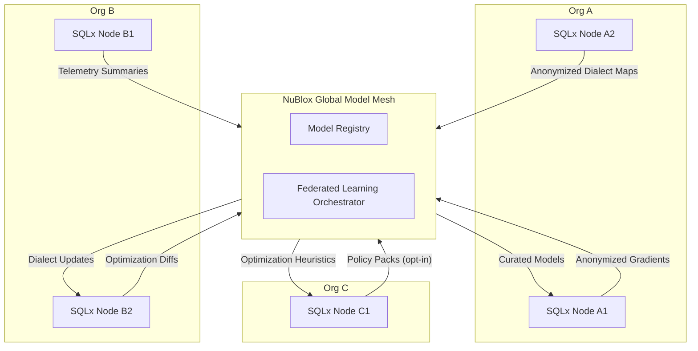
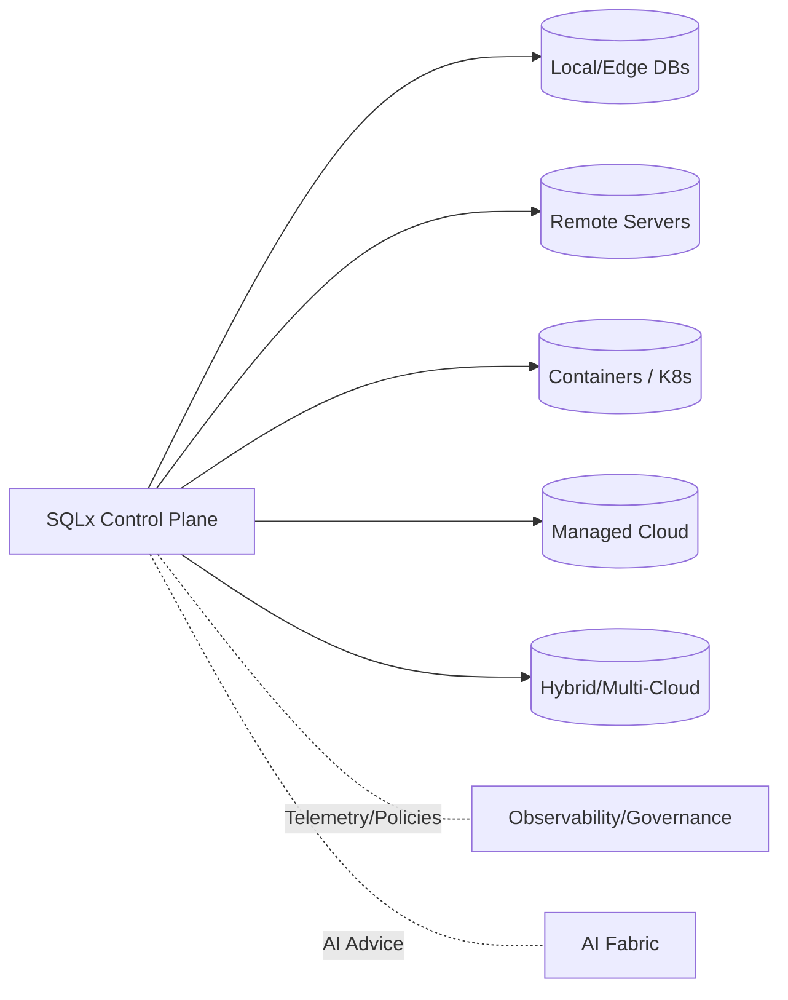

# NuBlox SQLx OS v4.0 — Diagram Pack
*(Mermaid + optional TikZ stubs; drop-in for Strategy Doc and Whitepaper)*

---

## 1) Kernel Modules Overview (Mermaid)
```mermaid
flowchart TB
    subgraph Kernel["SQLx OS Kernel"]
      KF[Connection / Session Fabric]
      AIR[Dialect Translator (AIR Engine)]
      TBus[AI Telemetry Bus]
      SEC[Security / Policy Runtime]
      OBS[Observability & Event Bus]
      SCH[Transaction Scheduler]
    end

    KF --> AIR
    AIR --> TBus
    TBus --> SEC
    TBus --> OBS
    SEC --> SCH
    SCH --> KF

    %% Edges to subsystems
    Kernel --> DRV[Driver Fabric]
    Kernel --> AIF[AI Fabric]
    Kernel --> GOV[Governance Core]
    Kernel --> OSTK[Observability Stack]
```

---

## 2) AI Fabric (Agents + Dataflows)


---

## 3) Universal Dialect Runtime (UDR) — Transform Path


---

## 4) Telemetry → Learning → Optimization Loop
```mermaid
flowchart LR
    QRY[Queries & Plans] --> FEAT[Feature Extraction]
    FEAT --> MOD[Model Update (RL+SL)]
    MOD --> REW[Reward/Eval Signals]
    REW --> POL[Policy Graph Check]
    POL --> ACT[Optimizer Actions]
    ACT --> QRY
    FEAT --> OBS[Observability Store]
    ACT --> EXP[Explainability Graphs]
```

---

## 5) Policy Enforcement Flow (Zero-Trust)


---

## 6) Federated Mesh Topology


---

## 7) Transaction Scheduler Analogy
```mermaid
flowchart LR
    Q[Incoming Transactions] --> CLS[Classify (latency/priority)]
    CLS --> QH[Queue Heads]
    QH -->|Preemptive| DISP[Dispatcher]
    DISP --> IOQ[I/O Queue]
    IOQ --> ENG[Engine Threads]
    ENG --> MET[Runtime Metrics]
    MET --> FB[Scheduler Feedback]
    FB --> CLS
```

---

## 8) Adaptive Deployment Fabric (Recap)
*(Use this if you need a compact version in the strategy doc.)*


---

## 9) Optional TikZ Stubs (LaTeX)
```latex
% AI Fabric Interaction (simplified)
\begin{tikzpicture}[node distance=10mm,>=latex,every node/.style={font=\small}]
\node[draw,rounded corners] (tin) {Telemetry Ingest};
\node[draw,rounded corners,below=of tin] (opt) {Optimizer Agent};
\node[draw,rounded corners,right=12mm of opt] (sca) {Schema Agent};
\node[draw,rounded corners,below=of opt] (sec) {Security Agent};
\node[draw,rounded corners,right=12mm of sec] (coa) {Compliance Agent};
\node[draw,rounded corners,below=of sec] (top) {Topology Agent};
\node[draw,rounded corners,right=12mm of top] (lga) {Language Agent};

\draw[->] (tin) -- (opt);
\draw[->] (tin) -- (sca);
\draw[->] (tin) -- (sec);
\draw[->] (tin) -- (coa);
\draw[->] (tin) -- (top);
\draw[->] (tin) -- (lga);

\node[draw,rounded corners,fill=gray!10,above=18mm of tin] (krn) {Kernel/Schedulers};
\node[draw,rounded corners,fill=gray!10,right=18mm of krn] (gov) {Governance Core};
\node[draw,rounded corners,fill=gray!10,right=18mm of gov] (air) {AIR Engine};

\draw[<->] (opt) -- (krn);
\draw[<->] (top) -- (krn);
\draw[<->] (sca) -- (gov);
\draw[<->] (sec) -- (gov);
\draw[<->] (coa) -- (gov);
\draw[<->] (lga) -- (air);
\end{tikzpicture}
```

```latex
% Federated Mesh Topology (simplified)
\begin{tikzpicture}[node distance=10mm,>=latex,every node/.style={font=\small}]
\node[draw,rounded corners] (a1) {Org A: Node A1};
\node[draw,rounded corners,below=of a1] (a2) {Org A: Node A2};
\node[draw,rounded corners,right=25mm of a1] (b1) {Org B: Node B1};
\node[draw,rounded corners,below=of b1] (b2) {Org B: Node B2};
\node[draw,rounded corners,right=25mm of b1] (c1) {Org C: Node C1};

\node[draw,rounded corners,fill=gray!10,above=15mm of b1] (mesh) {Global Model Mesh};
\node[draw,rounded corners,above=5mm of mesh] (reg) {Model Registry};
\node[draw,rounded corners,right=8mm of mesh] (fl) {FL Orchestrator};

\draw[->] (a1) -- (mesh);
\draw[->] (a2) -- (mesh);
\draw[->] (b1) -- (mesh);
\draw[->] (b2) -- (mesh);
\draw[->] (c1) -- (mesh);

\draw[->] (mesh) -- (a1);
\draw[->] (mesh) -- (b2);
\draw[->] (mesh) -- (c1);
\end{tikzpicture}
```
